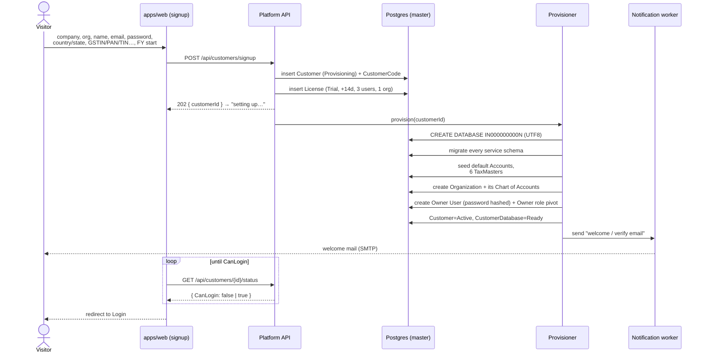
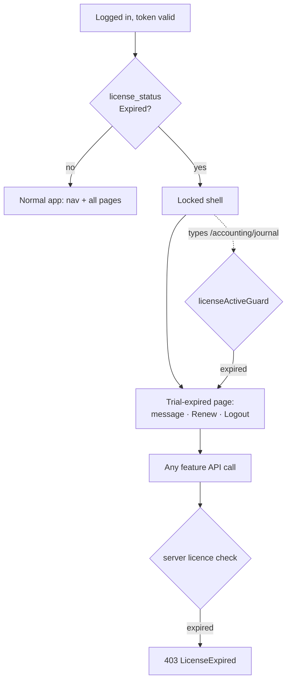

# SPEC.md — Tables & Pages

Build spec for **RetailErp**. Read `CLAUDE.md` first for conventions and hard rules; this file is the concrete what-to-build.

**Status key**: ✅ built · 🔨 designed, not built · 📋 scoped only, needs design

---

# PART 1 — TABLES

## Audit columns — on every table, no exceptions

**Every table in this spec** carries these four, inherited from `Shared.Kernel.Entities.AuditableEntity` (CLAUDE.md hard rule 6). They are **not** repeated in the per-table column lists below — assume them on all of them:

| Column | Type | Rules |
|---|---|---|
| `CreatedBy` | Guid? | Nullable. A user id for user-created rows; **null marks system/seed data** |
| `CreatedAt` | DateTimeOffset? | Nullable. Null for seed data written at provisioning |
| `ModifiedBy` | Guid? | Null until first user update |
| `ModifiedAt` | DateTimeOffset? | Null until first user update |

**All four are nullable.** A row with `CreatedBy = null` is system/default master data — seeded at provisioning by no human — and that null is the signal, so `CreatedBy IS NULL` cleanly distinguishes shipped reference data from anything a user added. When a user creates or edits a row, the interceptor stamps their id and the timestamp.

No table is exempt — this includes reference/seed masters (`mst.Currencies`, `mst.Countries`, `AccountTypes`, `TransactionTypes`, …), join tables (`idn.RolePermissions`), and child/detail tables (`acc.JournalDetails`, `acc.JournalEntryLines`).

The **only** exception is `acc.vw_LedgerDetail`, because it is a database **view**, not a table — it has no rows of its own to audit.

Values are written **only** by `AuditSaveChangesInterceptor`, never set by hand (CLAUDE.md hard rule 6).

## System-master naming convention

Every seeded/system master row carries **two names**:

| Column | Editable | Purpose |
|---|---|---|
| `SystemName` | **No** — set at seed, immutable | The canonical identity. All code, reports, GSTR mapping and seed logic key on this (or the id), never on the display name |
| `DisplayName` | Yes | What the UI shows. The user may rename it |

The rule: **a user can rename a system master for display, but can never change what it *is*.** Renaming the "Cost of Goods Sold" subtype to "COGS / Direct Cost" changes the label on screen and on reports; it does not change that this row is the COGS control point the sale posting targets. `SystemName` is hidden on every screen.

Applies to the system masters the user asked to be renamable — **Chart of Accounts (`AccountTypes`, system `Accounts`), Roles, Tax Master** — and to any future reference master with `IsSystem = true`. For a customer-created row (`IsSystem = false`) the two names are seeded equal and both stay editable.

Enforcement: on update of a row where `IsSystem = true`, reject any change to `SystemName` (or any column other than `DisplayName` and active flag) with `Forbid()`.

---

## MASTER DATABASE

### `mst.Countries` ✅
Seeded reference data. Referenced by `plt.Organizations` (real FK, same database) and by per-customer Contacts (unenforced id — cross-database FK impossible).

| Column | Type | Rules |
|---|---|---|
| CountryId | int | PK, **not** identity — explicit ids for seeding |
| CountryCode | string(2) | Required, unique. ISO 3166-1 alpha-2 |
| CountryName | string(100) | Required |
| CurrencyCode | string(3) | Required. ISO 4217 |
| PhoneCode | string(5)? | e.g. `+91`, `+1` |
| IsActive | bool | Default true |

Navigation: `ICollection<State> States`

**Seed**: IN/India/INR/+91, US/United States/USD/+1, GB/United Kingdom/GBP/+44, AE/United Arab Emirates/AED/+971, SG/Singapore/SGD/+65

### `mst.States` ✅
| Column | Type | Rules |
|---|---|---|
| StateId | int | PK, not identity |
| CountryId | int | Required, FK → Countries |
| StateCode | string(5) | Required. **For India this is the 2-digit GST state code** |
| StateName | string(100) | Required |
| IsActive | bool | Default true |

Unique index: (CountryId, StateCode)

**Seed** — all 37 Indian states/UTs by GST code: 01 Jammu and Kashmir, 02 Himachal Pradesh, 03 Punjab, 04 Chandigarh, 05 Uttarakhand, 06 Haryana, 07 Delhi, 08 Rajasthan, 09 Uttar Pradesh, 10 Bihar, 11 Sikkim, 12 Arunachal Pradesh, 13 Nagaland, 14 Manipur, 15 Mizoram, 16 Tripura, 17 Meghalaya, 18 Assam, 19 West Bengal, 20 Jharkhand, 21 Odisha, 22 Chhattisgarh, 23 Madhya Pradesh, 24 Gujarat, 26 Dadra and Nagar Haveli and Daman and Diu, 27 Maharashtra, 29 Karnataka, 30 Goa, 31 Lakshadweep, 32 Kerala, 33 Tamil Nadu, 34 Puducherry, 35 Andaman and Nicobar Islands, 36 Telangana, 37 Andhra Pradesh, 38 Ladakh, 97 Other Territory

### `mst.Currencies` ✅
Seeded reference data. The single source for currency code, symbol and display formatting — feeds `libs/shared/currency-format` on the frontend and base-currency conversion on the backend. Referenced by `mst.Countries.CurrencyCode` and `plt.Organizations.BaseCurrency` (real FKs, same DB) and by every per-customer transaction's `CurrencyCode` (unenforced string — cross-database).

| Column | Type | Rules |
|---|---|---|
| CurrencyId | int | PK, **not** identity — explicit ids for seeding |
| Code | string(3) | Required, unique. ISO 4217 |
| Name | string(60) | Required, e.g. `Indian Rupee` |
| Symbol | string(5) | Required, e.g. `₹` `$` `£`. UTF-8, may be multi-char (`CHF`, `kr`) |
| Format | string(30) | Required. Display mask, e.g. `###,###,##0.00` |
| DecimalPlaces | int | Required, default 2. **Drives money rounding, not just display** — JPY 0, KWD 3 |
| SymbolPosition | enum→string(6) | `Prefix` / `Suffix`, default Prefix |
| IsActive | bool | Default true |

**`Format` is the grouping mask, and India is the reason it's a column, not a constant.** Western grouping is threes — `###,###,##0.00` → `1,234,567.89`. Indian grouping is the lakh/crore pattern — `##,##,##0.00` → `12,34,567.89`. A single hard-coded format would render Indian amounts wrong, so each currency carries its own. `DecimalPlaces` is separate because rounding money must never be inferred from a display string.

**Seed** (matching the seeded countries, extend as needed):

| Id | Code | Name | Symbol | Format | Dp |
|---|---|---|---|---|---|
| 1 | INR | Indian Rupee | ₹ | `##,##,##0.00` | 2 |
| 2 | USD | US Dollar | $ | `###,###,##0.00` | 2 |
| 3 | GBP | Pound Sterling | £ | `###,###,##0.00` | 2 |
| 4 | AED | UAE Dirham | د.إ | `###,###,##0.00` | 2 |
| 5 | SGD | Singapore Dollar | S$ | `###,###,##0.00` | 2 |

> The user asked for "all currencies" — the five above match the seeded countries. The full ISO 4217 set (~180) is a larger seed to load at implementation from a data file, not to enumerate here. INR is the lone lakh/crore format; the rest use the threes mask, most at 2 dp (notable exceptions: JPY/KRW 0, KWD/BHD/OMR 3).

---

### `mst.TransactionTypes` 🔨
Every document type in the system. **Three-letter code as the key.** Referenced from per-customer tables by unenforced code — cross-database FK is impossible, so validate in C#.

| Column | Type | Rules |
|---|---|---|
| Code | string(3) | PK. Exactly three uppercase letters |
| Name | string(50) | Required, unique |
| IsLedgerPosting | bool | False for documents that post nothing (quote, orders) |
| IsActive | bool | Default true. Retire a type without deleting it |

**No maintenance UI.** All rows ship as seed data; a new document type is added by **EF migration**, never at runtime — a new code with no posting logic behind it would be unusable anyway. The API is **read-only**:

```
GET /api/master/transaction-types          all active types
GET /api/master/transaction-types/{code}   one type
```

**Seed** — 17 types, 14 posting and 3 non-posting:

| Code | Name | Posts |
|---|---|---|
| QTE | Quote | no |
| BIL | Bill | yes |
| POR | Purchase Order | no |
| GRN | Goods Receipt | yes |
| SOR | Sales Order | no |
| INV | Invoice | yes |
| CRN | Credit Note | yes |
| DBN | Debit Note | yes |
| JRN | Journal | yes |
| SPM | Spend Money | yes |
| RCM | Receive Money | yes |
| TRM | Transfer Money | yes |
| OPB | Opening Balance | yes |
| DEP | Depreciation | yes |
| STA | Stock Adjustment | yes |
| POS | POS Sale | yes |
| DLC | Delivery Challan | yes |

`DLC` is the newest and **arrives by EF migration**, like every other row here — a code added at runtime would have no posting logic behind it. It is the sales mirror of `GRN`: stock leaves on the challan, and the invoice that follows bills what was delivered.

The code is both the key and what appears on screen and in document numbers, so a ledger row reads without a join. **A code can never be changed once data exists** — every `JournalLedger`, `Journals` and `TransactionRatio` row stores it as a plain string with no FK to cascade a rename.

`IsLedgerPosting` is the data-level answer to "may this document type reach the ledger?" — the posting path checks it instead of hard-coding a list of codes.

### `mst.LedgerTypes` ✅
**Which leg** of a document a ledger row represents. Same pattern as TransactionTypes: seeded, no maintenance UI, read-only API, new rows by migration.

| Column | Type | Rules |
|---|---|---|
| LedgerTypeId | int | PK, **not** identity — explicit ids for seeding |
| Code | string(20) | Required, unique |
| Name | string(50) | Required |
| IsActive | bool | Default true |

**Seed** — 6 types:

| Id | Code | Name |
|---|---|---|
| 1 | ITEM | Line item |
| 2 | TAX | Tax |
| 3 | CONTROL | AP / AR / bank / cash control leg |
| 4 | COGS | Cost of goods sold |
| 5 | FX | Realized exchange gain or loss |
| 6 | ROUNDOFF | Rounding |

```
GET /api/master/ledger-types
```

### `mst.AccountTypes` ✅
The five fixed account types — the top and now **only** level above the chart of accounts. Global reference data, so it lives in the master database alongside the other seeded masters rather than being duplicated into every customer database. `acc.Accounts.AccountTypeId` references it as an unenforced id (cross-database FK is impossible).

| Column | Type | Rules |
|---|---|---|
| AccountTypeId | int | PK, **not** identity |
| SystemName | string(20) | Required, unique. **Immutable, hidden** — code and reports key on this |
| DisplayName | string(20) | Required. User-editable label |
| NormalBalance | enum→string(6) | Debit / Credit — which side increases the balance |
| ReportSection | enum→string(15) | BalanceSheet / ProfitAndLoss |
| SortOrder | smallint | Report ordering — these five always render in a fixed order |
| IsActive | bool | Default true |

**Seed** — exactly five, ids contractual (`SystemName` = `DisplayName` at seed):

| Id | Name | NormalBalance | ReportSection | Sort |
|---|---|---|---|---|
| 1 | Asset | Debit | BalanceSheet | 1 |
| 2 | Liability | Credit | BalanceSheet | 2 |
| 3 | Equity | Credit | BalanceSheet | 3 |
| 4 | Income | Credit | ProfitAndLoss | 4 |
| 5 | Expense | Debit | ProfitAndLoss | 5 |

Gross profit exists only because Income (4) and Expense (5) are distinct types — never merge them. `SortOrder` is kept here (unlike TransactionTypes) because reports *do* order by it.

```
GET /api/master/account-types
```

### `mst.LedgerSources` 🔨
**What produced** the ledger row. Since a payment and a refund share the same transaction type — both are Spend Money or Receive Money — this is what tells them apart. Anything that needs to distinguish them (refunds report, GST return, bank reconciliation) filters on `LedgerSourceId`, not on `TransactionTypeCode`.

| Column | Type | Rules |
|---|---|---|
| LedgerSourceId | int | PK, **not** identity |
| Code | string(20) | Required, unique |
| Name | string(50) | Required |
| Direction | enum→string(10) | In / Out / Both. Sanity-check against the transaction type |
| IsActive | bool | Default true |

Same pattern: seeded, no maintenance UI, read-only `GET /api/master/ledger-sources`, new rows by migration.

**Seed** — the `Typical type` column is guidance, not a constraint:

| Id | Code | Name | Typical type | Direction |
|---|---|---|---|---|
| 1 | TRANSACTION | Document posting | BIL, INV, CRN, DBN, POS, GRN | Both |
| 2 | BILLPAYMENT | Bill payment | SPM | Out |
| 3 | INVOICEPAYMENT | Invoice payment | RCM | In |
| 4 | BILLREFUND | Bill refund received | RCM | In |
| 5 | INVOICEREFUND | Invoice refund paid | SPM | Out |
| 6 | CREDITNOTEREFUND | Credit note refund paid | SPM | Out |
| 7 | DEBITNOTEREFUND | Debit note refund received | RCM | In |
| 8 | VENDORPREPAYMENT | Advance paid to vendor | SPM | Out |
| 9 | CUSTOMERPREPAYMENT | Advance received from customer | RCM | In |
| 10 | ALLOCATION | Credit note, debit note or prepayment allocation | CRN, DBN | Both |
| 11 | MONEYTRANSFER | Bank or cash transfer | TRM | Both |
| 12 | JOURNAL | Manual journal | JRN | Both |
| 13 | OPENINGBALANCE | Opening balance | OPB | Both |
| 14 | DEPRECIATION | Depreciation | DEP | Out |
| 15 | STOCKADJUSTMENT | Stock adjustment | STA | Both |

Payment and refund are deliberately **paired in opposite directions**: `BILLPAYMENT` pays a vendor and `BILLREFUND` receives money back from one, so the pair reconciles. Same for `INVOICEPAYMENT` / `INVOICEREFUND`.

`MONEYTRANSFER` is the one source with no contact — both legs are bank or cash accounts, so `ContactId` and `SubAccountId` are null and there is no AP/AR control leg.

---

### `plt.Customers` ✅
The account/billing entity. **One Customer = one physical database.**

| Column | Type | Rules |
|---|---|---|
| CustomerId | Guid | PK |
| CustomerCode | string(10) | Required, unique. 10-digit sequential, zero-padded (`D10`), generated in C# |
| CountryPrefix | string(2) | Required, default `IN` |
| Name | string(200) | Required |
| BillingEmail | string(200) | Required, email |
| Status | enum→string(20) | Provisioning / Active / Suspended / Trial / Expired |
| PlanTier | string(30) | Required, default `Standard` |

Navigation: `ICollection<Organization> Organizations`, `CustomerDatabase? CustomerDatabase`, `License License`

Database name = `CountryPrefix + CustomerCode` → `IN0000000001`

### `plt.Licenses` 🔨
One per Customer. A **Trial** licence is created automatically at signup — the customer never picks it.

| Column | Type | Rules |
|---|---|---|
| LicenseId | Guid | PK |
| CustomerId | Guid | Required, FK → Customers, unique (one-to-one) |
| LicenseType | enum→string(20) | Required, default `Trial`. Trial / Standard / Professional / Enterprise |
| StartDate | DateOnly | Required, default today |
| ExpiryDate | DateOnly | Required. Trial = StartDate + 14 days |
| MaxUsers | int | Trial default 3 |
| MaxOrganizations | int | Trial default 1 |
| IsActive | bool | Default true |
| GraceDays | int | Default 0. Read-only access window after expiry, if any |

A licence is **expired** when `today > ExpiryDate + GraceDays`. Expiry is evaluated at login and stamped onto `Customers.Status = Expired`; it does not need a nightly job, though one may flip status proactively for reporting. **Expiry blocks the app, never the login** — see the trial-expiry flow.

### `plt.Organizations` ✅
A set of books. Many per Customer, sharing that Customer's database, separated by `OrgId`.

| Column | Type | Rules |
|---|---|---|
| OrgId | Guid | PK |
| CustomerId | Guid | Required, FK → Customers |
| Name | string(200) | Required |
| BaseCurrency | string(3) | Required, default `INR` |
| FinancialYearStartMonth | int | Range 1–12, default 4 (April) |
| Gstin | string(15)? | |
| Pan | string(10)? | |
| Tan | string(10)? | |
| Tin | string(15)? | |
| Cin | string(21)? | |
| UdyamNumber | string(20)? | |
| LogoUrl | string(500)? | Blob storage path — never store the image itself |
| Status | enum→string(20) | Provisioning / Active / Suspended / Trial |
| AddressLine1 | string(200)? | |
| AddressLine2 | string(200)? | |
| City | string(100)? | |
| StateId | int? | FK → mst.States |
| PostalCode | string(10)? | |
| CountryId | int | Required, FK → mst.Countries |
| PhoneNumber | string(20)? | Regex `^\d{2,}[\s\-]?\d{3,}$` — STD code mandatory |
| MobileNumber | string(20)? | No regex — lengths vary by country |
| Email | string(200)? | Email |
| Website | string(200)? | Url |

Unique index: (CustomerId, Name)

**Validate `StateId`'s StateCode matches Gstin's first 2 digits** — a mismatch silently breaks CGST/SGST vs IGST.

### `plt.OrgCurrencies` 🔨
The currencies an organization actually transacts in — a per-org subset of `mst.Currencies`. Lives in `plt` so it can FK both `Organizations` and `mst.Currencies`; a per-customer-DB table could reference neither. Audit columns apply as everywhere — the trail of who enabled a currency and when is genuinely useful here.

| Column | Type | Rules |
|---|---|---|
| OrgCurrencyId | Guid | PK |
| OrgId | Guid | Required, FK → Organizations |
| CurrencyId | int | Required, FK → mst.Currencies |
| IsBaseCurrency | bool | Default false. **Exactly one true per org** |
| IsActive | bool | Default true. Deactivate to retire a currency without losing history |

Unique index: `(OrgId, CurrencyId)`, plus partial `UNIQUE (OrgId) WHERE IsBaseCurrency` so an org can have only one base.

- **Seeded at org creation** with one row: the org's `BaseCurrency`, `IsBaseCurrency = true`. `Organizations.BaseCurrency` stays the authority; this row must always match it, and the base row cannot be deactivated or deleted.
- This is what the **currency picker** on every transaction lists — an org sees only its active currencies, not all ~180.
- It also scopes **exchange-rate sync**: `rat.CurrencyRates` only needs rates for pairs an org has enabled here.

### `plt.Configurations` 🔨
Generic key-value settings — the long tail of tunables (decimal places, default due days, document prefixes, feature toggles) without a column each. A **system default row** (`OrgId = null`) ships the shipped value; a per-org row overrides it.

| Column | Type | Rules |
|---|---|---|
| ConfigId | Guid | PK |
| OrgId | Guid? | **Null = system default.** Set = this org's override |
| Code | string(50) | Required. Stable key, e.g. `unitPrice.decimals`. Never renamed — code reads it |
| Name | string(100) | Required. Display label, e.g. `Unit Price Decimals` |
| Description | string(300)? | Help text shown on the settings screen |
| DataType | enum→string(10) | Required. `Number` / `Text` / `Boolean` / `Date` / `Json` |
| Value | string(1000) | Required. Stored as text, **parsed per `DataType`** |
| Category | string(50)? | Groups rows on the settings page, e.g. `Formatting`, `Documents` |
| IsSystem | bool | Default false. System keys can be overridden but not deleted |

Unique index: `(OrgId, Code)`, plus partial `UNIQUE (Code) WHERE OrgId IS NULL` (one system default per key).

**Effective value** = the org's row for that `Code` if present, else the system-default row. Resolve once per request and cache; a typed accessor casts `Value` by `DataType` (`GetInt`, `GetBool`, …) so callers never parse strings.

**Seed** (system defaults, `OrgId = null`, `IsSystem = true`):

| Code | Name | Description | DataType | Value |
|---|---|---|---|---|
| `unitPrice.decimals` | Unit Price Decimals | Decimal places for unit price inputs | Number | `2` |
| `quantity.decimals` | Quantity Decimals | Decimal places for quantity inputs | Number | `2` |
| `sales.dueDays` | Sales Due Days | Default payment terms on invoices | Number | `30` |
| `purchase.dueDays` | Purchase Due Days | Default payment terms on bills | Number | `30` |

> **This supersedes the two typed decimal columns** that were briefly on `plt.Organizations` (`QuantityDecimalPlaces`, `PriceDecimalPlaces`). Keeping both would be two sources of truth for the same number; the config table is the single home. `mst.Currencies.DecimalPlaces` stays where it is — money precision is a property of the currency, not an org tunable.

### `plt.CustomerDatabases` ✅
Tenant directory.

| Column | Type | Rules |
|---|---|---|
| CustomerId | Guid | PK **and** FK → Customers (one-to-one) |
| DatabaseName | string(63) | Required, unique. Postgres identifier limit |
| ConnectionSecretRef | string(200) | Required. **Key Vault reference — never the raw connection string** |
| Status | enum→string(20) | Provisioning / Ready / Failed |
| ProvisionedAt | DateTimeOffset? | |

### `plt.ApiClients` 📋
| Column | Type | Rules |
|---|---|---|
| ApiClientId | Guid | PK |
| OrgId | Guid | Required |
| ClientId | string(100) | Required, unique |
| ClientSecretHash | string(500) | Required. **Hashed; shown once at creation** |
| Name | string(200) | Required |
| Scopes | string(1000) | Comma-separated, e.g. `read:inventory,write:sales` |
| RateLimitTier | string(30) | |
| IsActive | bool | Default true |

### `plt.PlatformAdminUsers` 📋
Operator staff, separate from tenant users in `idn`.

### `plt.SmtpSettings` 🔨
The outbound mail account used to send invitations, OTPs and password-reset mail. One system default (`CustomerId = null`); a customer may override with its own mailbox.

| Column | Type | Rules |
|---|---|---|
| SmtpSettingsId | Guid | PK |
| CustomerId | Guid? | **Null = system default.** Set = this customer's own mailbox |
| Host | string(200) | Required, e.g. `smtp.gmail.com` |
| Port | int | Required, e.g. 587 |
| UseSsl | bool | Default true |
| FromEmail | string(200) | Required, email. The `From` address |
| FromName | string(200) | Required, e.g. `Bill-Book` |
| Username | string(200) | Required. SMTP auth user (often = FromEmail) |
| PasswordEncrypted | string(1000) | Required. **Reversibly encrypted (AES via a Key Vault data-protection key) — NOT hashed.** The worker must recover the plaintext to authenticate to the SMTP server |
| IsActive | bool | Default true |

Unique index: `(CustomerId)` — one row per customer, one system row where null.

> **Encrypted, not hashed — and this is the one place that is correct.** Everywhere else a secret is stored (`Users.PasswordHash`, `RefreshTokens.TokenHash`, OTP codes) it is **hashed**, one-way, because we only ever need to *verify* it. An SMTP password is different: the Notification worker has to present the actual password to the mail server, so it must be recoverable. Store it AES-encrypted with a key from Key Vault, never plaintext, never in a log. The encryption key lives in Key Vault, not in the database or config.

---

### `idn.Users` ✅
| Column | Type | Rules |
|---|---|---|
| UserId | Guid | PK |
| Email | string(200) | Required, unique, email |
| PasswordHash | string(500) | **Hashed with BCrypt work factor 12 — one-way, never encrypted, never reversible.** Null/empty for invited users until they set one |
| DisplayName | string(200) | Required |
| MobileNumber | string(20)? | Stored with leading `+` for foreign numbers. Needed for OTP-by-SMS |
| EmailConfirmed | bool | |
| MobileConfirmed | bool | |
| TwoFactorEnabled | bool | |
| IsActive | bool | Default true |
| ThemePreference | string(10) | Default `System`. Light / Dark / System |
| FailedLoginCount | int | Lockout at 5 |
| LockedOutUntil | DateTimeOffset? | 15-minute lockout |
| LastLoginAt | DateTimeOffset? | |

### `idn.Roles` ✅
| Column | Type | Rules |
|---|---|---|
| RoleId | int | PK, identity |
| CustomerId | Guid? | **Null = built-in system role**; set = customer-defined |
| SystemName | string(100) | Required. **Immutable, hidden** — the canonical role identity |
| DisplayName | string(100) | Required. User-editable label |
| Description | string(300)? | |
| IsSystemRole | bool | System roles: permissions are read-only, but `DisplayName` and `Description` may be edited |
| IsActive | bool | Default true |

Unique index: `(CustomerId, SystemName)`, plus partial `UNIQUE (SystemName) WHERE CustomerId IS NULL` so two system roles can't share a name (Postgres treats nulls as distinct)

**Seed** (`SystemName` = `DisplayName` at seed): 1 Owner, 2 Administrator, 3 Accountant, 4 Sales, 5 Viewer — all `IsSystemRole = true`, `CustomerId = null`

A system role's **permission set** is fixed, but the customer may rename it — calling "Accountant" → "Finance Lead" for display — without altering what it grants.

### `idn.Permissions` ✅
| Column | Type | Rules |
|---|---|---|
| PermissionId | int | PK, identity |
| Code | string(100) | Required, unique. Format `{module}.{action}` |
| Module | string(50) | Required |
| Description | string(200)? | |

**Seed**: 12 modules × 10 actions = 120 permissions.
Modules: dashboard, contacts, crm, inventory, sales, purchase, accounting, banking, reports, settings, support, platform
Actions: view, create, edit, approve, void, delete, print, export, import, AllUserData

Role grants: Owner + Administrator → everything except `platform.*` · Viewer → all `.view` · Accountant → accounting, banking, reports, purchase · Sales → sales, contacts, crm

> **⚠ open — the module-level grants above now hand out `approve`, `void` and `AllUserData` wholesale.** With four actions, "Accountant → accounting, banking, reports, purchase" was a reasonable shorthand. With ten it also grants self-approval, voiding of posted documents, and visibility of every user's data in those modules. These three need per-role decisions rather than a blanket module grant.

`AllUserData` is a **data-scope** permission, not an action: without it a user sees only records they created, with it they see the whole organization's. It rides the same `{module}.{action}` format for consistency, but the authorization check is a query filter, not a gate on an endpoint.

### `idn.RolePermissions` ✅
| Column | Type | Rules |
|---|---|---|
| RolePermissionId | long | PK, identity |
| RoleId | int | Required, FK |
| PermissionId | int | Required, FK |

Unique index: (RoleId, PermissionId)

### `idn.UserOrganizationRoles` ✅
**The pivot that makes multi-org access work.** One login, different roles per organization.

| Column | Type | Rules |
|---|---|---|
| UserOrganizationRoleId | long | PK, identity |
| UserId | Guid | Required, FK → Users |
| OrgId | Guid | Required (no FK — Organizations owned by Platform service) |
| RoleId | int | Required, FK → Roles |
| IsActive | bool | Default true. Revoke by setting false, don't delete |

Unique index: (UserId, OrgId, RoleId)

### `idn.RefreshTokens` ✅
| Column | Type | Rules |
|---|---|---|
| RefreshTokenId | long | PK, identity |
| UserId | Guid | Required, FK |
| TokenHash | string(500) | Required, indexed. **SHA-256 — never plaintext** |
| ExpiresAt | DateTimeOffset | Required. 7 days |
| RevokedAt | DateTimeOffset? | Set on rotation, logout, or password reset |
| IpAddress | string(45)? | |
| UserAgent | string(300)? | |

### `idn.LoginHistories` ✅
| Column | Type | Rules |
|---|---|---|
| LoginHistoryId | long | PK, identity |
| UserId | Guid | Required, FK |
| OrgId | Guid? | |
| LoginAt | DateTimeOffset | Required |
| IsSuccessful | bool | |
| FailureReason | string(200)? | |
| IpAddress | string(45)? | |
| UserAgent | string(300)? | |

### `idn.PasswordResetTokens` ✅
Also used for **user invitations** — same mechanism, longer expiry.

| Column | Type | Rules |
|---|---|---|
| PasswordResetTokenId | long | PK, identity |
| UserId | Guid | Required, FK |
| TokenHash | string(500) | Required, indexed |
| ExpiresAt | DateTimeOffset | Required. **Invitation only, 7 days.** A long random link token |
| UsedAt | DateTimeOffset? | Single-use |

Invitations stay **link-based** (a long token in a URL). Forgot-password is now **OTP-based** — see below.

### `idn.OtpVerifications` 🔨
A short numeric code sent to email or mobile. Used by forgot-password, and reusable for mobile/email confirmation.

| Column | Type | Rules |
|---|---|---|
| OtpVerificationId | long | PK, identity |
| UserId | Guid | Required, FK |
| Purpose | enum→string(20) | Required. PasswordReset / EmailConfirm / MobileConfirm |
| Channel | enum→string(10) | Required. Email / Sms |
| Destination | string(200) | Required. The email or masked mobile the code went to |
| CodeHash | string(500) | Required. **The 6-digit code, hashed (SHA-256) — never stored plaintext** |
| ExpiresAt | DateTimeOffset | Required. **10 minutes** |
| AttemptCount | int | Default 0. **Lock after 5 wrong tries** |
| ConsumedAt | DateTimeOffset? | Single-use |

Indexes: `(UserId, Purpose, ExpiresAt)`.

The code is 6 digits, generated with a cryptographic RNG, and only its hash is stored — same discipline as passwords. A new request invalidates any unconsumed code for the same `(UserId, Purpose)`. Mobile delivery needs an **SMS provider**, which is not yet in the stack — see the flow note.

### `rat.CurrencyRates` 📋 / `rat.MetalRates` 📋
Dated history, not just today's rate. Manual override always available.

---

## PER-CUSTOMER DATABASE

Every table below needs `OrgId` (Guid, required) + EF Core global query filter + Postgres RLS policy.

> **`AccountSubTypes` has been removed** (decision, not omission). The chart of accounts is now **two levels**: `mst.AccountTypes` → `acc.Accounts`, with `ParentAccountId` providing any display grouping a subtype layer used to give. Two consequences were handled rather than dropped:
> - **`IsContra` moved onto `acc.Accounts`.** It used to live on the subtype; without rehoming it, Accumulated Depreciation, Sales Returns, Discount Given and Purchase Returns would stop subtracting and every report would overstate.
> - **`AccountTypeId` is now chosen directly, not derived.** The old "always derive from the subtype, never accept from a caller" rule no longer applies — there is no subtype to derive from. It is still immutable once the account is used (config lock).

### `acc.Accounts` 🔨
The Chart of Accounts. Seeded **per organization** at org creation.

| Column | Type | Rules |
|---|---|---|
| AccountId | long | PK, identity |
| OrgId | Guid | Required |
| AccountTypeId | int | Required → `mst.AccountTypes`, unenforced (cross-database). Directly chosen; immutable once used |
| IsContra | bool | Default false. Normal balance opposite its type — **reports subtract**. Rehomed from the removed subtype |
| AccountCode | string(20) | Required |
| AccountSystemName | string(200)? | System accounts only: immutable canonical name. Null for user accounts |
| AccountName | string(200) | Required. Display name. **Editable even on system accounts** |
| ParentAccountId | long? | Self-FK |
| CurrencyCode | string(3)? | Null = org base currency |
| IsSystemDefault | bool | Seeded control accounts — cannot be deleted; **config-locked from creation** (see below) |
| IsActive | bool | Default true. Operational — changeable any time |
| IsUsed | bool | Default false. Set true — **and never back** — the first time this account is referenced by any posting or master row. Drives the config lock |
| IsJE | bool | Default false. May this account be picked on a **manual journal** line. **Backend/admin only — never a customer-facing toggle**, and settable only while the config is unlocked |
| IsLock | bool | Default false. Posting freeze — **no posting of any kind**, manual or system. Operational, changeable any time; orthogonal to the config lock |
| IsSales | bool | Default false. Selectable as an income/revenue account on a **sales** document |
| IsPurchase | bool | Default false. Selectable as an expense/asset account on a **purchase** document |
| IsPayment | bool | Default false. Selectable as the settlement account on a **payment / receipt** (Spend/Receive Money) |
| IsBank | bool | Default false. This account **is** a bank or cash account — appears in bank pickers, reconciliation and Transfer Money |

Unique index: (OrgId, AccountCode) · Filtered indexes: `(OrgId) WHERE IsBank`, `(OrgId) WHERE IsSales`, `(OrgId) WHERE IsPurchase`

#### Configuration lock — what can change, and when

Two independent locks, deliberately not the same column:

- **`IsLock`** freezes *posting*. A used account stays fully configurable-for-posting until an admin sets this; a locked account still exists and still shows balances, it just rejects new lines. Reversible.
- **Config lock** freezes *what the account is*. It is **not** a stored flag — it is the condition `IsUsed = true OR IsSystemDefault = true`. Once true it never clears (an account cannot be un-used).

When the config is locked, these become **immutable**: `AccountTypeId`, `IsContra`, `AccountCode`, `AccountSystemName`, and all the usage flags `IsJE`, `IsSales`, `IsPurchase`, `IsPayment`, `IsBank`. Still editable: `AccountName` (display), `IsActive`, `IsLock`, `ParentAccountId`.

The rules that produce it:
1. **First use flips `IsUsed`.** Any reference — a `JournalDetail` or `JournalLedger` row, a `SubAccount` parented to it, a document line, an opening balance — sets `IsUsed = true` in the same transaction, atomically. From that instant the account's nature is frozen: you cannot re-point a used Expense account to become an Asset, because its existing postings would silently reclassify.
2. **`IsJE` is backend-only.** It is never rendered as an editable control on the customer Chart-of-Accounts page. An operator sets it from the backend (admin tool / seed), and only while `IsUsed = false` and `IsSystemDefault = false`. After first use it is fixed like the rest.
3. **System accounts are locked from creation.** `IsSystemDefault = true` config-locks the row at seed — before any use — so the ten control accounts can never have their type, code or usage flags changed. Their flag values are fixed by the seed table below.

Enforcement lives on write: reject a change to any immutable column when the config lock holds, with `Forbid()`. A missing check here lets someone reclassify an account that already holds a year of postings.

**Seed at org creation**: Accounts Receivable, Accounts Payable, Inventory, Input GST, Output GST, Sales Revenue, Cost of Goods Sold, Realized FX Gain/Loss, Unrealized FX Gain/Loss, Opening Balance Equity — all `IsSystemDefault = true`

Flag defaults on the seeded accounts — the system posts to these directly, so they are **off** the manual-journal and document pickers:

| Account | IsJE | IsSales | IsPurchase | IsPayment | IsBank |
|---|---|---|---|---|---|
| Accounts Receivable | ✗ | ✗ | ✗ | ✗ | ✗ |
| Accounts Payable | ✗ | ✗ | ✗ | ✗ | ✗ |
| Inventory | ✗ | ✗ | ✗ | ✗ | ✗ |
| Input GST / Output GST | ✗ | ✗ | ✗ | ✗ | ✗ |
| Sales Revenue | ✗ | ✓ | ✗ | ✗ | ✗ |
| Cost of Goods Sold | ✗ | ✗ | ✓ | ✗ | ✗ |
| Realized / Unrealized FX | ✓ | ✗ | ✗ | ✗ | ✗ |
| Opening Balance Equity | ✓ | ✗ | ✗ | ✗ | ✗ |

A cash/bank account created later (e.g. "HDFC Current A/c") is the one that carries `IsBank = ✓` and `IsPayment = ✓`. None of the ten seeded control accounts is a bank account.

### `acc.SubAccounts` 🔨
Per-contact and per-item detail under a parent control account. Keeps the CoA small.

| Column | Type | Rules |
|---|---|---|
| SubAccountId | long | PK, identity |
| OrgId | Guid | Required |
| AccountTypeId | int | Required, FK. **Denormalized from parent Account** |
| AccountId | long | Required, FK → Accounts |
| ReferenceType | enum→string(20) | Contact / Item / **Tax** |
| ReferenceId | long | Polymorphic pointer, no FK. ContactId, ItemId or **TaxRateId** |
| TaxComponent | enum→string(10) | Default `None`. **Cgst / Sgst / Igst** for `Tax` subaccounts; `None` for Contact/Item |
| SubAccountName | string(200) | Required |
| IsActive | bool | Default true |

Unique index: **(AccountId, ReferenceType, ReferenceId, TaxComponent)** — the component completes the key so three rows can share a parent and rate

**Auto-created**, always as a side effect of the owning master, never by hand:
- each **Contact** → 2 (Accounts Receivable, Accounts Payable)
- each **Item** → 3 (Inventory, Cost of Goods Sold, Sales Revenue)
- each **Tax Master** → up to **6** GST subaccounts — CGST, SGST and IGST in each direction:
  - under the **Input GST** control account: Input CGST, Input SGST, Input IGST — created when the rate `IsPurchase`
  - under the **Output GST** control account: Output CGST, Output SGST, Output IGST — created when the rate `IsSales`

For a `Tax` subaccount, `ReferenceId` is the `TaxRateId`, the **parent account gives the direction** (Input GST = Asset, Output GST = Liability), and **`TaxComponent` gives the component** (CGST/SGST/IGST). Together — parent + rate + component — the six rows are distinct under the unique index. `SubAccountName` reads e.g. `Output CGST — GST 18%`. This is the finest GST granularity: every posting lands on the right rate **and** the right component, so GSTR-1/3B and ITC can be built straight from the subledger.

Which components a transaction hits is set by tax determination, not stored per subaccount: intra-state → CGST + SGST subaccounts; inter-state → the IGST subaccount. All six stand ready; each posting uses the two-or-one that apply.

### `acc.TaxMasters` 🔨
| Column | Type | Rules |
|---|---|---|
| TaxRateId | long | PK, identity |
| OrgId | Guid | Required |
| TaxSystemName | string(50)? | Seeded rows only: immutable canonical name (e.g. `GST18`). Null for user-created rows |
| TaxName | string(50) | Required. Display name — editable on seeded rows |
| TotalRate | decimal(5,2) | Required |
| CgstRate | decimal(5,2) | Required. Check: `CgstRate = SgstRate` |
| SgstRate | decimal(5,2) | Required. Check: `CgstRate + SgstRate = TotalRate` |
| IgstRate | decimal(5,2) | Required. Check: `IgstRate = TotalRate` |
| CessRate | decimal(5,2) | Default 0 |
| EffectiveFrom | DateOnly | Required |
| EffectiveTo | DateOnly? | Null = currently in effect |
| IsSales | bool | Default true. Selectable as an **output** tax on sales documents |
| IsPurchase | bool | Default true. Selectable as an **input** tax on purchase documents |
| IsActive | bool | Default true |

At least one of `IsSales` / `IsPurchase` must be true — a rate usable on neither document is dead data. Filtered indexes: `(OrgId) WHERE IsSales`, `(OrgId) WHERE IsPurchase`, for the tax pickers.

**Creating a rate auto-creates its GST subaccounts** (`acc.SubAccounts`, `ReferenceType = Tax`): CGST, SGST and IGST under Input GST when `IsPurchase`, and the same three under Output GST when `IsSales` — up to six per rate. Deactivating or expiring a rate deactivates its subaccounts. Same event-driven pattern as Contact and Item subaccounts.

**Seed at org creation** (all seeded rows `IsSales = true` and `IsPurchase = true`, so each seeds all **six** GST subaccounts): GST 0% · 5% (2.5+2.5) · 12% (6+6) · 18% (9+9) · 28% (14+14) · **3% Bullion (1.5+1.5)**

### `acc.PaymentTerms` ✅
Owned by Accounting, surfaced as a Settings screen — Sales and Purchase both need it, so it cannot live inside either.

| PaymentTermId long PK · OrgId · TermSystemName string(30)? · TermName string(50) · TermType enum→string(20) · DueDays int · DueDayOfMonth int? · DiscountPercent decimal(5,2) · DiscountDays int · IsSales · IsPurchase · IsDefault · IsSystem · IsActive · DisplayOrder int |

Indexes: unique (OrgId, TermName) · filtered unique system name · filtered unique (OrgId) WHERE IsDefault · sales/purchase filtered · order index

Check constraints: applies to sales or purchase · DayOfNextMonth ⇔ DueDayOfMonth · DueOnReceipt ⇒ DueDays = 0 · discount window ≤ due days on Net · discount % ⇒ discount days

**Due-date calculation lives in Accounting and is exposed at `GET /api/payment-terms/{id}/due-date`.** DayOfNextMonth clamps: day 31 in February is the 28th, never 3 March. A seeded term's rule is immutable — contacts and unpaid documents point at it — while its name stays editable.

Seed: Due on Receipt (default) · Net 15 · Net 30 · Net 45 · Net 60 · End of Month

### `acc.NumberingSeries` ✅
Every generated code in the product: master codes now, document numbers as Sales and Purchase land. One table rather than a generator per master — they all need a prefix, zero padding, a financial-year segment and a per-branch variant, and only one of those can be got subtly wrong.

**The entity lives in `Shared.Kernel`, not `Accounting.Entity`.** Accounting owns the migration and the Settings API; every other service maps the same entity into its own DbContext with `ExcludeFromMigrations()` and allocates locally. An HTTP hop cannot join the caller's transaction, and a rolled-back document would leave a consumed number behind — for a GST invoice series that is a gap an auditor asks about. This is a deliberate, documented exception to CLAUDE.md rule 8: no service touches another's DbContext, but the table is genuinely shared.

| Column | Type | Rules |
|---|---|---|
| NumberingSeriesId | long | PK, identity |
| OrgId | Guid | Required |
| SeriesSystemName | string(30)? | Seeded rows only: immutable canonical name. Null for user-created |
| SeriesCode | string(30) | Required. The lookup key — `CUSTOMER`, `ITEM`, or for documents the three-letter `mst.TransactionTypes` code |
| SeriesName | string(50) | Required. Display name, editable on seeded rows |
| SeriesFor | enum→string(10) | `Master` / `Document`. Fixed after creation |
| Prefix / Suffix | string(15)? | |
| Separator | string(1)? | Default `-`. Empty runs segments together |
| IncludeFinancialYear | bool | Default false |
| FinancialYearFormat | enum→string(15) | `FullYearRange` 2025-26 · `ShortYearRange` 25-26 · `Compact` 2526 · `StartYear` 2025 |
| IncludeBranchCode | bool | Default false |
| BranchCode | string(10)? | The branch's own `Organization.OrgCode`, **copied onto the series** rather than read back — composing a number must never cross into the master database, and a renamed branch must not restyle numbers already issued |
| NumberLength | int | Default 5. Zero-padding width |
| StartNumber | long | Default 1 |
| NextNumber | long | The counter |
| ResetFrequency | enum→string(10) | `Never` / `Yearly` / `Monthly` / `Daily`. Yearly means the **financial** year |
| LastResetOn | DateOnly? | Null until the first reset |
| AllowManualOverride | bool | Refused on document series |
| IsDefault | bool | Preselected when several share a code and branch |
| IsSystem | bool | Seeded: renamable, never deletable |
| IsActive | bool | Default true |
| DisplayOrder | int | Default 0, seeded in tens |

Indexes: unique (OrgId, SeriesName) · `IX_NumberingSeries_Lookup` (OrgId, SeriesCode) · filtered unique `IX_NumberingSeries_Default` (OrgId, SeriesCode) WHERE IsDefault · filtered unique `IX_NumberingSeries_SystemName` (OrgId, SeriesSystemName) WHERE NOT NULL · `IX_NumberingSeries_Order` (OrgId, DisplayOrder, SeriesName)

Check constraints: `SeriesFor = 'Master' OR AllowManualOverride = false` · `NextNumber >= StartNumber AND NumberLength BETWEEN 1 AND 12` · `IncludeBranchCode = false OR BranchCode IS NOT NULL`

**Allocation is a compare-and-swap**, not read-max-then-increment: a single `ExecuteUpdateAsync` that moves the counter only if it still holds the value that was read, retried when it affects no rows. It runs inside the caller's transaction, which is what keeps a document series gapless when the surrounding insert rolls back. The number is taken **at save, never at form open** — reserving on open leaves a gap for every abandoned draft.

**Seed at org creation** (all `IsSystem`, `IsDefault`, `AllowManualOverride = true`, reset `Never`): `CUSTOMER` CUST-00001 · `VENDOR` VEND-00001 · `ITEM` ITM-00001 · `WAREHOUSE` WH-001 · `BANK` BNK-001. Document series are seeded by Sales and Purchase.

Deactivating is refused when it would leave a code with no active series, or the next contact saved fails with a numbering error far from anything the user did. Rows are never hard-deleted — codes they issued are on records.

### `con.Contacts` ✅
Customers, vendors, job workers and prescribers — one table with role flags. Separate tables would duplicate the GSTIN and addresses of any party that is both, which in Indian SMB books is routine. Receivable and payable stay apart through their sub-accounts, not through the master.

| Column | Type | Rules |
|---|---|---|
| ContactId | long | PK, identity |
| OrgId | Guid | Required |
| ContactCode | string(20) | Required, unique per org. From the `CUSTOMER` / `VENDOR` numbering series unless typed |
| IsCustomer · IsVendor · IsJobWorker · IsPrescriber | bool | **At least one true** — check constraint |
| ContactCategory | enum→string(15) | Business / Individual |
| DisplayName | string(200) | Required |
| LegalName | string(200)? | Name as on the GST certificate |
| Gstin | string(15)? | Format + checksum validated |
| GstRegistrationType | enum→string(20) | Regular / Composition / Unregistered / SEZ / Overseas / Consumer |
| Pan · Tan | string? | |
| PlaceOfSupplyStateId | int? | Unenforced → `mst.States`. **Decides CGST+SGST vs IGST** |
| CountryId | int? | Unenforced → `mst.Countries` |
| CurrencyCode | string(3) | Default org base |
| PaymentTermId | long? | Unenforced → `acc.PaymentTerms` (cross-service) |
| CreditLimit | decimal(18,2)? | Null = unlimited |
| MaxOutstandingDays | int? | **From the due date**, not the invoice date |
| MaxDiscountPercent | decimal(5,2)? | |
| ReceivableAccountId · PayableAccountId | long? | Overrides; unenforced → `acc.Accounts` |
| IsTdsApplicable + TdsSection | bool + string(10)? | |
| IsMsme + UdyamNumber | bool + string(20)? | |
| Notes | string(500)? | |
| IsActive | bool | Default true |

**No email, phone or website.** They live on `con.ContactPersons`, where exactly one row is the default — one place to look up where an invoice is emailed rather than two that can disagree.

Indexes: unique (OrgId, ContactCode) · filtered unique (OrgId, Gstin) WHERE NOT NULL · (OrgId, DisplayName) · four filtered role indexes

Check constraints: at least one role · TDS ⇒ section · MSME ⇒ Udyam · limits in range · registration type ⇔ GSTIN present or absent

Validated in C# (spans rows or crosses a service): **GSTIN's first two digits must equal the place-of-supply state's GST code**, verified against `mst.States` through Master's API and cached · GSTIN unique across contacts · at least one active person, exactly one default · the default person must have an email or mobile · one default address per type.

**On create** → six sub-accounts in Accounting via `POST internal/sub-accounts/provision` — trade, prepayment advance and overpayment advance beneath each of Accounts Receivable and Accounts Payable, discriminated by `SubAccountPurpose`. Idempotent **per target**, so re-running it for a contact created before the advances existed backfills exactly the four it is missing.

### `con.ContactAddresses` ✅
| ContactAddressId long PK · OrgId · ContactId (FK, cascade) · AddressType enum→string(10) Billing/Shipping · IsDefault · Label string(50)? · AddressLine1 string(200) · AddressLine2 string(200)? · Landmark string(100)? · City string(100) · StateId int? · CountryId int · PostalCode string(10)? · Gstin string(15)? · ContactPersonName string(100)? · PhoneNumber · MobileNumber · IsActive |

Filtered unique (OrgId, ContactId, AddressType) WHERE IsDefault — one default billing, one default shipping.

**Place of supply resolution**: document override → default Shipping state → `Contact.PlaceOfSupplyStateId` → default Billing state. Wrong order posts IGST on intra-state sales.

### `con.ContactPersons` ✅
| ContactPersonId long PK · OrgId · ContactId (FK, cascade) · ContactPersonRoleId (FK, **restrict**) · Salutation string(10)? · FirstName string(100) · LastName string(100)? · Designation string(100)? · Email string(150)? · PhoneNumber · MobileNumber · Website string(200)? · IsDefault · IsActive |

Filtered unique (OrgId, ContactId) WHERE IsDefault · (OrgId, MobileNumber) WHERE NOT NULL — counter staff search by phone constantly.

### `con.ContactPersonRoles` ✅
| ContactPersonRoleId long PK · OrgId · RoleSystemName string(30)? · RoleName string(50) · DisplayOrder int · IsDefault · IsSystem · IsActive |

Seeded: Primary (default) · Owner/Proprietor · Accounts · Purchase · Sales · Dispatch · Support · Other. Maintained from a popup, not a page. A role in use cannot be deleted — deactivate instead.

### `inv.*` — Inventory masters ✅
Nine tables. The core item is vertical-neutral; pharma and jewellery attributes sit in 1:0..1 extensions so their required fields are plain `NOT NULL` rather than a conditional check per vertical.

**`inv.UomTypes`** — UomTypeId · UomTypeSystemName? · UomTypeName · DisplayOrder · IsSystem · IsActive. Six seeded, user-extensible. No `BaseUomId`: the base is a flag on the unit, where a filtered unique index guarantees at most one per type.

**`inv.UnitOfMeasures`** — UomId · UomTypeId (FK, restrict) · UomSystemName? · **UomCode** · **UqcCode** · UomName · **IsBaseUnit** · **ConversionToBase** decimal(18,6) · DecimalPlaces · DisplayOrder · IsSystem · IsActive.
Checks: factor > 0 · base ⇒ factor = 1 · decimals 0–6. Filtered unique `(OrgId, UomTypeId) WHERE IsBaseUnit`.
**The only conversion mechanism in the system.** Pack sizes are units of their type — a 50 kg bag is a Weight unit with factor 50 — which is why there is no `ItemUoms` table. `UqcCode` is separate because carat and tola are not notified units.

**`inv.ItemCategories`** — self-referencing tree, **maximum depth 3**, with `DefaultItemProfile`, `DefaultCostingType` and `DefaultUomTypeId` copied onto an item at creation and independent thereafter.

**`inv.MetalPurities`** — per metal, `PurityFactor` decimal(6,4) — 22K is 0.9160. Frozen once an item uses it. Seeded with the standard Indian purities, finest first.

**`inv.Items`** — the SKU. Five unit columns: `UomTypeId`, `InventoryUomId`, `SalesUomId`, `PurchaseUomId`, `ReportUomId`, all of which must belong to the type. Stock, weighted average cost and quantity precision come from the inventory unit. Prices store **per the inventory unit**, so changing the sales unit cannot silently reprice.
Checks: `TrackInventory` ⇔ `CostingType <> None` · expiry ⇒ batch · Fefo ⇒ batch + expiry · SpecificIdentification ⇒ serial · MinSalePrice ≤ SalesPrice.
**Locked once stock has moved**: UomTypeId, InventoryUomId, CostingType, ItemProfile and the three tracking flags.

**`inv.ItemJewelleryDetails`** / **`inv.ItemPharmaDetails`** — ItemId is key and FK both, cascade. Nominal design weights on the jewellery side; each physical piece's actual weights and HUID belong to its serial row.

**`inv.ItemBarcodes`** — unique per org, filtered unique primary per item, `BarcodeType` including GS1 DataMatrix.

**`inv.Warehouses`** — location dimension only; stock is one shared pool and WAC is company-wide. Own GSTIN, `StorageType`, one default per org.

### `bnk.Banks` / `bnk.BankAccounts` ✅
**`bnk.Banks`** — BankId · OrgId · BankCode (unique) · BankName · DisplayOrder · IsSystem · IsActive. The institution, so its name is entered once.

**`bnk.BankAccounts`** — BankAccountId · OrgId · BankId? (FK, restrict — null only for Cash and Wallet) · **LedgerAccountId?** · AccountName · AccountNumber · AccountType enum→string(15) · Ifsc? · Micr? · SwiftCode? · Iban? · BranchName? · CurrencyCode · OdLimit? · IsDefault · DisplayOrder · IsActive.

Indexes: unique (OrgId, BankId, AccountNumber) · filtered unique `(OrgId, LedgerAccountId)` where not null — **one GL account per bank account, never shared**, or reconciliation cannot tell two apart · filtered unique default · order index.
Checks: Cash/Wallet ⇔ BankId may be null · OdLimit only on OverDraft/CashCredit/CreditCard.

**Creating an account creates its `acc.Accounts` row.** A full account, not a sub-account — bank journal lines carry no sub-dimension, so a sub-account would leave the bank with no ledger identity. Mapping: Savings/Current → Asset under 1500 · Cash/Wallet → Asset under 1400 · OverDraft/CashCredit/CreditCard → **Liability** under 2300. Flags `IsBank`, `IsPayment` and `IsJE` true; `IsSystemDefault` true, so it is config-locked and undeletable.

**Idempotent on `AccountSystemName = "BANK:{id}"`**, guarded by a new filtered unique index on `(OrgId, AccountSystemName)`. The HTTP call cannot join Banking's transaction, so the row is inserted with a null `LedgerAccountId` and linked immediately after; a failure leaves the account visibly unlinked with a retry action rather than discarding what was typed.

**Three parent groups added to the org-creation seed**: 1400 Cash in Hand (Asset) · 1500 Bank Accounts (Asset) · 2300 Bank OD & Credit Cards (Liability), all `IsLock = true` so nothing posts to the group.

### `bnk.MoneyTransactions` / `bnk.MoneyTransactionDetails` ✅
Spend money (`SPM`), receive money (`RCM`) and transfer money (`TRM`) — **one table pair discriminated by `TransactionTypeCode`**, not three. The three share every column that matters; what differs is a destination account on a transfer and a contact on the other two. The same shape decision T2.1 takes for `sal`.

**`bnk.MoneyTransactions`** — header.

| Column | Type | Rules |
|---|---|---|
| MoneyTransactionId | long | PK, identity |
| OrgId | Guid | Required |
| TransactionTypeCode | string(3) | Required → `mst.TransactionTypes`, no FK. `SPM` / `RCM` / `TRM` only, by check constraint |
| TransactionNo | string(30)? | **Null while Draft** — the number is taken at post, never at draft |
| TransactionDate | DateOnly | Required |
| BankAccountId | long | Required, FK → `bnk.BankAccounts`, restrict. On a transfer this is the **source** |
| ToBankAccountId | long? | FK → `bnk.BankAccounts`, restrict. **Transfers only**, and never equal to `BankAccountId` |
| ContactId | long? | No FK — Contacts owns it. **Null on a transfer**, which is the one money document with no counterparty |
| Amount | decimal(18,2) | Required, > 0. Its detail lines must sum to exactly this before it can post |
| CurrencyCode | string(3) | Required |
| ExchangeRate | decimal(18,8) | Default 1, > 0. **Snapshot at TransactionDate — never live.** The difference between this and the settled document's rate *is* the realized FX gain or loss |
| PaymentMethod | enum→string(20) | Cash / Cheque / BankTransfer / Upi / Card / DemandDraft / Wallet / Other |
| ReferenceNo | string(50)? | Cheque number, UTR, UPI reference |
| ReferenceDate | DateOnly? | Instrument date, when a cheque carries one |
| Memo | string? | Unbounded |
| Status | enum→string(10) | Draft / Posted / Void |
| PostedAt · PostedBy | DateTimeOffset? · Guid? | |
| VoidedAt · VoidedBy · VoidReason | DateTimeOffset? · Guid? · string(300)? | A posted document is voided, never deleted — a gap in a document series is what an auditor asks about |

Filtered unique: (OrgId, TransactionTypeCode, TransactionNo) where number not null · Indexes: (OrgId, TransactionDate), (OrgId, BankAccountId, TransactionDate), (OrgId, ContactId)

**Check constraints**: number-on-post · posted stamp agrees with status · void stamp agrees with status · `Amount > 0` · `ExchangeRate > 0` · transfer shape (TRM ⇒ destination and no contact; otherwise no destination) · no transfer to the same account · type is one of the three.

**`bnk.MoneyTransactionDetails`** — what each part of the money *was*, and what it settles.

| Column | Type | Rules |
|---|---|---|
| MoneyTransactionDetailId | long | PK, identity |
| OrgId | Guid | Required |
| MoneyTransactionId | long | Required, FK, **cascade** |
| LineNumber | int | Required. Unique within the document |
| **LedgerSourceId** | int | Required → `mst.LedgerSources`, no FK. **This is where a payment says what kind of payment it is** |
| MappingTransactionTypeCode | string(3)? | The document settled — `BIL`, `INV`, `CRN`, `DBN`. No FK |
| MappingTransactionId | long? | Paired with the code: both null, or both set |
| Amount | decimal(18,2) | Required, > 0. Direction is the document's, so a refund is a different source, never a negative amount |
| AmountBase | decimal(18,2) | Required, > 0. At the header's rate |
| LineMemo | string(300)? | |

Unique index: (MoneyTransactionId, LineNumber) · Index: (OrgId, MappingTransactionTypeCode, MappingTransactionId) — "what has been paid against this bill?"

**Check constraints**: amounts > 0 · mapping paired (an id with no type resolves to nothing; a type with no id names every document at once).

**Deferred constraint trigger**, on both tables: the lines must sum to the header's `Amount` — but **only once Posted**, so a draft may be part-allocated while it is being keyed. Two triggers, not one: posting changes the header and never touches the lines, so a line-only trigger would miss the one path that matters most. The same pair `acc.Journals` carries, for the same reason.

**Why the source is on the line and not the header.** A payment of ₹11,000 against a ₹10,000 bill is a bill payment *and* a supplier deposit at once: ₹10,000 settles the bill, ₹1,000 becomes an advance. Record one meaning on the header and a payables report asking for bill payments quietly misses the ₹10,000 that genuinely was one. The same mechanism covers a payment split across several bills — one line per bill, one bank movement.

### `acc.Journals` ✅
Manual journal header.

**Built, with two deliberate deviations from the columns below** — both recorded in [`TRANSACTIONS-ACCOUNTING-BANKING.md`](./TRANSACTIONS-ACCOUNTING-BANKING.md) T0.5:

- **`JournalNo` is nullable**, with a filtered unique index on the non-null values. The number is taken **at post, not at draft** — a draft that is never posted must not consume one from a series that has to run without gaps. Two check constraints hold both halves: a draft has no number, and anything past Draft must have one.
- **Only manual journals live here.** T0.7 was answered *manual journals only*: every other document posts straight to `JournalLedger` under its own type and id, with no header shadowing it. `TransactionTypeCode` and `SourceId` stay for a future document that wants one.

| Column | Type | Rules |
|---|---|---|
| JournalId | long | PK, identity |
| OrgId | Guid | Required |
| JournalNo | string(30) | Required |
| JournalDate | DateOnly | Required |
| CurrencyCode | string(3) | Required |
| ExchangeRate | decimal(18,8) | Default 1. **Snapshot at JournalDate — never live** |
| Reference | string(200)? | |
| Memo | string? | Unbounded text |
| TransactionTypeCode | string(3) | Required → `mst.TransactionTypes`, no FK. `JRN` when hand-written, else the source document's type |
| SourceId | long? | Source document header, polymorphic, no FK |
| Status | enum→string(10) | Draft / Posted / Reversed |
| PostedAt | DateTimeOffset? | |
| PostedBy | Guid? | |
| ReversesJournalId | long? | Self-FK. Set on the **reversing** journal |
| ReversedByJournalId | long? | Self-FK. Set on the **reversed** journal |

Unique index: (OrgId, JournalNo) · Indexes: (OrgId, JournalDate), (OrgId, TransactionTypeCode, SourceId)

### `acc.JournalDetails` ✅
Journal lines. Debit and credit are mutually exclusive per line.

**Built, and it carries `OrgId`** — contrary to the note further down this section. Every other detail table in the product carries its own, and CLAUDE.md requires `OrgId` plus a query filter on every per-customer table without exception. Scoping through the parent means no EF query filter at all and an RLS policy that has to subquery the header, which is strictly weaker than the two lines every other table gets for nothing.

| Column | Type | Rules |
|---|---|---|
| JournalDetailId | long | PK, identity |
| JournalId | long | Required, FK, cascade delete |
| LineNumber | int | Required |
| AccountId | long | Required, FK → Accounts |
| SubAccountId | long? | FK → SubAccounts. AR/AP → contact, item legs → item, **GST legs → the rate + component (CGST/SGST/IGST) subaccount**. Null only for bank and equity lines |
| DebitAmount | decimal(18,2) | Default 0 |
| CreditAmount | decimal(18,2) | Default 0 |
| DebitAmountBase | decimal(18,2) | Default 0 |
| CreditAmountBase | decimal(18,2) | Default 0 |
| LineMemo | string(300)? | |
| ReversesJournalDetailId | long? | Self-FK. The original line this row reverses |
| ReversedByJournalDetailId | long? | Self-FK. The line that reversed this row |

Unique index: (JournalId, LineNumber) · Indexes: (ReversesJournalDetailId)

**Check constraints**:
- `chk_debit_credit_exclusive`: `(DebitAmount > 0 AND CreditAmount = 0) OR (CreditAmount > 0 AND DebitAmount = 0)`
- `chk_amounts_non_negative`: all four amounts ≥ 0

~~**No `OrgId`** — scoped via parent Journal.~~ **Superseded**: it carries its own, for the reason at the head of this section.

**Deferred constraint trigger** (raw SQL in migration, no LINQ equivalent): on insert/update/delete, if parent status is `Posted`, sum(DebitAmountBase) must equal sum(CreditAmountBase). `DEFERRABLE INITIALLY DEFERRED` so multi-line inserts don't trip on intermediate state.

**As built there are two triggers, not one.** The trigger above fires on the lines — but posting a draft changes the *header* and leaves the lines untouched, so it never fires for the one path that matters most. A second deferred trigger on `acc.Journals` covers it: without it, an unbalanced draft could be posted simply by flipping its status.

**Reversal is line-paired, not just header-paired.** `Journals` links the two documents; `JournalDetails` links each individual line to the line it offsets. Without the detail-level pair, a partially reversed journal cannot be told apart from a fully reversed one, and a reversal that omits a line still balances — so nothing catches it.

### `acc.JournalLedger` ✅
**The single posting target.** Every financial document in the system — invoice, bill, payment, refund, journal, opening balance, depreciation, stock adjustment — writes its double-entry legs here and nowhere else. This is what reports read.

| Column | Type | Rules |
|---|---|---|
| LedgerId | long | PK, identity |
| OrgId | Guid | Required |
| LedgerDate | DateOnly | Required. Posting date |
| AccountId | long | Required, FK → Accounts. The GL account being hit |
| SubAccountId | long? | FK → SubAccounts. Set for AP, AR, Inventory **and GST** legs; null for bank and equity |
| TransactionTypeCode | string(3) | Required → `mst.TransactionTypes`, no FK |
| TransactionId | long | Required. Source document header |
| TransactionDetailId | long | Required, default 0. Source document line; `0` when the leg is not line-level |
| DebitAmount | decimal(18,2) | Default 0. Transaction currency |
| CreditAmount | decimal(18,2) | Default 0. Transaction currency |
| DebitAmountBase | decimal(18,2) | Default 0. `ROUND(DebitAmount / ExchangeRate, 2)` |
| CreditAmountBase | decimal(18,2) | Default 0. `ROUND(CreditAmount / ExchangeRate, 2)` |
| CurrencyCode | string(3) | Required |
| ExchangeRate | decimal(18,8) | Default 1. **Snapshot at LedgerDate — never live** |
| TaxExchangeRate | decimal(18,8)? | Tax may settle at a different rate |
| ContactId | long? | Customer or vendor. No FK — owned by Contacts |
| LedgerTypeId | int | Required → `mst.LedgerTypes`. Which leg this is |
| LedgerSourceId | int | Required → `mst.LedgerSources`. What produced it |
| SourceDocumentId | long? | Provenance |
| TransactionDesc | string(500)? | Description shown in the ledger |
| MappingTransactionId | long? | **Links a payment back to its document** |
| MappingTransactionTypeCode | string(3)? | **Type of the mapped document** |
| JournalId | long? | Set when `LedgerSourceId = 12` (Journal) |

Indexes: (OrgId, LedgerDate) · (OrgId, AccountId, LedgerDate) · (OrgId, TransactionTypeCode, TransactionId) · (OrgId, MappingTransactionTypeCode, MappingTransactionId) · (OrgId, ContactId) · (OrgId, SubAccountId)

**Check constraints**: same two as `JournalDetails` — debit/credit exclusive, all four amounts ≥ 0.

**Deferred constraint trigger**: sum(DebitAmountBase) = sum(CreditAmountBase) per (`OrgId`, `TransactionTypeCode`, `TransactionId`). `DEFERRABLE INITIALLY DEFERRED`.

#### Document posting

One row per leg, all under the document's own `TransactionTypeCode`:

| Leg | Account | LedgerTypeId |
|---|---|---|
| Line item | Item's GL account | 1 `ITEM` |
| Tax | Tax GL account | 2 `TAX` |
| AP / AR control | Accounts Payable or Accounts Receivable | 3 `CONTROL` |
| COGS + Inventory | COGS and Inventory accounts | 4 `COGS` |

Posted documents only — a draft or void document writes nothing.

#### Payment posting and the mapping pair

A payment posts under its **own** identity (`SPM` Spend Money for a bill payment, `RCM` Receive Money for an invoice receipt) and points back at the document it settles:

| | Debit row | Credit row |
|---|---|---|
| `AccountId` | Accounts Payable — clears the liability | Bank or cash account |
| `TransactionTypeCode` | `SPM` | `SPM` |
| `TransactionId` | the payment id | the payment id |
| `TransactionDetailId` | payment line if line-level, else `0` | `0` |
| `LedgerTypeId` | 3 `CONTROL` | 3 `CONTROL` |
| `LedgerSourceId` | 2 `BILLPAYMENT`, or 8 `VENDORPREPAYMENT` | same |
| **`MappingTransactionId`** | **the bill's `TransactionId`** | same |
| **`MappingTransactionTypeCode`** | **`BIL`** | same |

That pairing is the whole mechanism for tracing a payment to its bill or invoice. It is also why payments never appear in stock tables — they carry no item dimension.

**Foreign-currency settlement** posts an extra pair to the Realized FX Gain/Loss account with `LedgerTypeId = 5`, mapped in the opposite direction (`MappingTransactionId` = the gain/loss source). Compute the gain or loss from the difference between the document's `ExchangeRate` and the payment's — never from a live rate.

**Idempotency.** Service Bus is at-least-once, so a consumer must dedup before inserting or a redelivered event doubles the ledger. Dedup on the source event id, and treat a document's ledger rows as a single atomic set — delete and re-post rather than patch.

### `acc.TransactionRatio` 🔨
Allocation between documents — a credit note applied across invoices, or a prepayment drawn down. Written alongside the ledger rows, never instead of them.

| Column | Type | Rules |
|---|---|---|
| TransactionRatioId | long | PK, identity |
| OrgId | Guid | Required |
| TransactionTypeCode | string(3) | Required. The allocating document, e.g. `CRN` Credit Note |
| TransactionId | long | Required |
| TransactionDetailId | long | Default 0 |
| MappingTransactionTypeCode | string(3) | Required. The target document, e.g. `INV` Invoice |
| MappingTransactionId | long | Required |
| MappingTransactionDetailId | long | Default 0 |
| AllocatedAmount | decimal(18,2) | Required. Transaction currency |
| AllocatedAmountBase | decimal(18,2) | Required. Base currency |
| Ratio | decimal(9,6) | Proportion of the target line consumed |
| AllocationDate | DateOnly | Required |
| CurrencyCode | string(3) | Required |
| ExchangeRate | decimal(18,8) | Default 1 |

Indexes: (OrgId, TransactionTypeCode, TransactionId) · (OrgId, MappingTransactionTypeCode, MappingTransactionId)

Allocations must never exceed the target's outstanding balance. Enforce in C# — the sum spans rows, so no check constraint can express it.

### `acc.vw_LedgerDetail` — combined transaction view ❌ *not built, by decision*
One flattened read model over `JournalLedger`, joining the names that reports and the ledger screen need, so every transaction type is queried the same way regardless of which service wrote it.

Resolves: `mst.TransactionTypes` (code, name), `mst.LedgerTypes`, `mst.LedgerSources`, `acc.Accounts` (code, name, type, subtype), `acc.SubAccounts` (name), and the mapped document's transaction-type code. `ContactId` stays an id — Contacts is another service, so resolve names in C#, **batched**.

Adds `RunningBalanceBase`, computed as a window function over (`OrgId`, `AccountId`) ordered by `LedgerDate`, `LedgerId`.

Mapped as an EF Core **keyless entity**. Two things it must have:

- **`security_invoker = true`** on the view. Without it the view runs as its owner and **bypasses the RLS policies on `JournalLedger`**, which would leak the general ledger across organizations. This is not optional.
- The EF global query filter on `OrgId` applies to the keyless entity as well — belt and braces alongside RLS.

> **⚠ `CREATE VIEW` is not in `CLAUDE.md`'s raw-SQL exception list.** That list is `CREATE DATABASE`, RLS policies, triggers and `set_config`. A view needs raw SQL in a migration, so either the list grows to include views, or this becomes a LINQ projection in the Reporting service instead of a database object. Decide before implementing.
>
> **Decided (T0.6): the view was not built, and the exception list did not grow.** The account ledger and the trial balance are LINQ projections in Accounting, and the running balance is accumulated in C# over the ordered result. A ledger read is always scoped to one account, ordered, and cut to a date range — which is everything the window function needed — so the view bought less than the exception cost. The `security_invoker` hazard above is the other half of the reason: a view that forgets it reads straight past RLS and hands one branch another branch's general ledger, and that is one migration away from happening by accident.

### `sal.*` — five document pairs 🔨

**One table pair per document type.** T2.1 was decided as a single discriminated pair and then reversed by the owner; the reversal is recorded in `TRANSACTIONS.md`.

| Document | Header | Lines |
|---|---|---|
| `QTE` Quote | `sal.Quotes` | `sal.QuoteDetails` |
| `SOR` Sales order | `sal.SalesOrders` | `sal.SalesOrderDetails` |
| `DLC` Delivery challan | `sal.DeliveryChallans` | `sal.DeliveryChallanDetails` |
| `INV` Invoice · `POS` POS sale | `sal.Invoices` | `sal.InvoiceDetails` |
| `CRN` Credit note | `sal.CreditNotes` | `sal.CreditNoteDetails` |

Ten tables. Each header still carries `TransactionTypeCode`, because the ledger posting, the numbering series and the register all key on it.

**`DLC` is the sales mirror of `GRN`, and the reason the sales chain now has three steps like purchase does.** Stock leaves on the challan; the invoice that follows bills what was delivered. Without it stock can only leave on an invoice, which breaks deliver-today-invoice-later, part deliveries, goods sent on approval, branch transfers and job work — and an e-way bill hangs off the challan, not the invoice.

*What it posts is an open decision, and it is the exact mirror of T4.1's GRNI question.* Issuing stock as `Dr Cost of Goods Sold` at delivery would book cost with no revenue against it. **Recommendation: seed a `Goods Delivered Not Invoiced` control account (Asset), post `Dr GDNI / Cr Inventory` on the challan, and `Dr COGS / Cr GDNI` on the invoice.** A balance sitting in GDNI is goods gone and not yet billed, which is a number worth having. A challan for job work or a branch transfer posts nothing at all — nothing was sold.

**A POS sale has no table of its own — it is a row in `sal.Invoices` with `TransactionTypeCode = 'POS'`.** It is the same document: same lines, same GST, same stock issue, same `Dr Accounts Receivable / Cr Sales Revenue`. What differs is the screen and that payment is taken at the same moment. **POS is a UI module, not a data model.** `TransactionTypeCode` is fixed per table everywhere except `sal.Invoices`, which holds `INV` or `POS` — and that distinction still has to be stored, because the two use different numbering series and GSTR-1 usually reports a till sale as B2C.

**The columns are the same in all five pairs.** Write them once as base classes in `Shared.Kernel` and inherit — not copy. Hand-maintained copies of a tax split is how a GST column comes to mean one thing on an invoice and another on a credit note.

```
DocumentHeaderBase : OrgScopedEntity     the header columns below
DocumentLineBase   : OrgScopedEntity     the line columns below
```

Each concrete table adds only what is its own.

#### Header columns — every pair

| Column | Type | Rules |
|---|---|---|
| {Doc}Id | long | PK, identity |
| OrgId | Guid | Required |
| TransactionTypeCode | string(3) | Required. Fixed per table |
| DocumentNo | string(30)? | **Nullable.** Taken at post, never at draft. Filtered unique index |
| DocumentDate | DateOnly | Required |
| ContactId | long | Required. No FK — Contacts is another service |
| ContactName | string(200) | Snapshot. A renamed customer must not restate a printed invoice |
| ContactGstin | string(15)? | Snapshot. Statutory |
| BillingAddress / ShippingAddress | string? | Snapshots |
| PlaceOfSupplyStateId | int | Required |
| IsInterState | bool | **Stored, not re-derived.** Set once when the document is created, from the branch's state against the party's place of supply. It decides which components the tax rows carry — CGST + SGST, or IGST — and re-deriving it later against a party who has since moved would silently reclassify a document already filed with a return |
| CurrencyCode | string(3) | Required |
| ExchangeRate | decimal(18,8) | Default 1. Snapshot at document date |
| SubTotal / DiscountAmount / TaxableAmount | decimal(18,2) | |
| CgstAmount / SgstAmount / IgstAmount / CessAmount | decimal(18,2) | |
| RoundOffAmount | decimal(18,2) | Signed |
| TotalAmount / TotalAmountBase | decimal(18,2) | |
| Status | enum→string(10) | Draft / Posted / Void |
| Notes / TermsAndConditions | string? | |
| PostedAt / PostedBy | DateTimeOffset? / Guid? | |
| VoidedAt / VoidedBy / VoidReason | DateTimeOffset? / Guid? / string(300)? | |

**Per-table extras**, which is what the split buys — each is `NOT NULL` where it belongs instead of nullable everywhere:

| Table | Adds |
|---|---|
| `Quotes` | `ValidUntil` **required** |
| `SalesOrders` | `DeliveryDate`, `FulfilmentStatus` (Open / PartlyDelivered / Closed / Cancelled) |
| `DeliveryChallans` | `SalesOrderId?`, `ChallanType` (Sale / JobWork / Approval / BranchTransfer / Sample), `DispatchDate`, `VehicleNo?`, `TransporterName?`, `EwayBillNo?`, `EwayBillDate?` |
| `Invoices` | `PaymentTermId?`, `DueDate?`, `QuoteId?`, `SalesOrderId?`, `DeliveryChallanId?`<br>**POS rows only**: `TillId?`, `CashierUserId?`, `PaymentMode?`, `TenderedAmount?`, `ChangeAmount?` |
| `CreditNotes` | `InvoiceId` **required**, `ReasonCode` |

Each conversion link is a **real foreign key** — `Invoices.SalesOrderId → SalesOrders`, `CreditNotes.InvoiceId → Invoices` — instead of one polymorphic `SourceSaleId` the database cannot enforce. That is the main gain from a table per type.

#### Line columns — every pair

| Column | Type | Rules |
|---|---|---|
| {Doc}DetailId | long | PK, identity |
| {Doc}Id | long | Required, FK, cascade delete |
| OrgId | Guid | Required. Detail tables carry their own — see T0.5 |
| LineNumber | int | Required |
| ItemId | long? | **Nullable.** No FK — Inventory is another service. Null makes this a **free-text line**: a service, freight, a one-off charge, anything not in the item master |
| ItemCode / ItemName | string(50)? / string(200)? | Snapshots. Null on a free-text line |
| HsnSacCode | string(8)? | Snapshot from the item, or **typed directly** on a free-text line — an SAC code is statutory on a service invoice whether or not the service is a catalogued item |
| Description | string(500)? | **Required when `ItemId` is null.** It is the only thing naming what was sold |
| WarehouseId | long? | Location only — never partitions stock. Null on a free-text line |
| Quantity | decimal(18,6) | As entered |
| UomId | long | |
| ConversionFactor | decimal(18,6) | Stored, not re-derived |
| BaseQuantity | decimal(18,6) | In the item's inventory unit. Equals `Quantity` on a free-text line |
| UnitPrice | decimal(18,6) | Per **entered** unit |
| IsPriceInclusive | bool | Inclusive back-computes `taxable = inclusive ÷ (1 + rate)`. MRP-inclusive is the Indian retail default, pharma especially. **Orthogonal to `TaxTreatment`** — one says how the price was quoted, the other whether tax applies |
| DiscountPercent / DiscountAmount | decimal(9,6)? / decimal(18,2) | |
| GrossAmount / TaxableAmount | decimal(18,2) | Discount reduces the taxable value |
| TaxTreatment | enum→string(10) | **Taxable / ZeroRated / NilRated / Exempt / NonGst.** Snapshot of the item's `TaxPreference` at document date. Charging nothing and being outside the tax are different facts, and GSTR-1 reports them in different tables — an item reclassified next year must not restate a document already filed |
| TaxMasterId / TaxGroupId | long? | → `acc.TaxMasters`, unenforced. Null when `TaxTreatment` is not Taxable or ZeroRated |
| TaxAmount | decimal(18,2) | **Total of this line's tax rows.** The component split lives in the tax child table, not in columns here |
| LineTotal | decimal(18,2) | `TaxableAmount + TaxAmount` |
| LineType | enum→string(10) | **Stock** / **Expense** / **Capital**. Default Stock. On a bill it decides which account the line posts to; on an invoice `Capital` is a fixed-asset **disposal**, which is why this sits in the base rather than on `BillDetails` alone |
| AccountId | long? | **The account this line posts to when there is no item to post through.** Required on a free-text line and on any `Expense` line; ignored when the line is item-backed, because an item already resolves its own revenue, inventory and COGS sub-accounts. One column rather than a separate expense and income one — a line posts to exactly one account either way |
| FixedAssetCategoryId | long? | Required when `LineType = Capital` |
| ItemBatchId | long? | One lot per line |
| LineNotes | string(300)? | |

**Per-table extras**:

| Table | Adds |
|---|---|
| `QuoteDetails` | — |
| `SalesOrderDetails` | `ReservedQuantity`, `DeliveredQuantity` |
| `DeliveryChallanDetails` | `SalesOrderDetailId?`, `InvoicedQuantity` |
| `InvoiceDetails` | `SalesOrderDetailId?`, `ReturnedQuantity` |
| `CreditNoteDetails` | `InvoiceDetailId` **required** — a return must name the line it reverses, which is how stock goes back to its original cost layer |

#### Indexes and constraints — the same set on every pair

Header — filtered unique `(OrgId, DocumentNo)` where not null · (OrgId, DocumentDate) · (OrgId, ContactId) · (OrgId, Status)
Lines — unique `({Doc}Id, LineNumber)` · (OrgId, ItemId) · (OrgId, ItemBatchId)

Header checks: draft has no number and anything past draft has one · `PostedAt` set iff past draft · on `sal.Invoices`, `TransactionTypeCode IN ('INV','POS')`, and a `POS` row needs `TillId` and `PaymentMode` while an `INV` row needs `DueDate` · `ExchangeRate > 0` · amounts non-negative except `RoundOffAmount` · `TotalAmount = TaxableAmount + Cgst + Sgst + Igst + Cess + RoundOff`
Line checks: `Quantity > 0` · `BaseQuantity = Quantity × ConversionFactor` · `DiscountAmount <= GrossAmount` · amounts non-negative · `LineTotal = TaxableAmount + TaxAmount` · `chk_line_tax_treatment` · `chk_line_type` — `Expense` ⇒ `ExpenseAccountId` set, `Capital` ⇒ `FixedAssetCategoryId` set, `Stock` ⇒ neither

#### Tax rows — one child table per detail table

**A line's tax is rows, not columns.** Intra-state is two components (CGST + SGST), inter-state is one (IGST), and cess is a third on top — so a fixed set of `CgstAmount` / `SgstAmount` / `IgstAmount` columns is a shape that only ever half-applies.

| Detail table | Tax table |
|---|---|
| `sal.QuoteDetails` | `sal.QuoteDetailTaxes` |
| `sal.SalesOrderDetails` | `sal.SalesOrderDetailTaxes` |
| `sal.DeliveryChallanDetails` | `sal.DeliveryChallanDetailTaxes` |
| `sal.InvoiceDetails` | `sal.InvoiceDetailTaxes` |
| `sal.CreditNoteDetails` | `sal.CreditNoteDetailTaxes` |
| `pur.PurchaseOrderDetails` | `pur.PurchaseOrderDetailTaxes` |
| `pur.GoodsReceiptDetails` | `pur.GoodsReceiptDetailTaxes` |
| `pur.BillDetails` | `pur.BillDetailTaxes` |
| `pur.DebitNoteDetails` | `pur.DebitNoteDetailTaxes` |

All nine share one base class, `DocumentLineTaxBase : OrgScopedEntity`, for the same reason the headers and lines do.

| Column | Type | Rules |
|---|---|---|
| {Doc}DetailTaxId | long | PK, identity |
| {Doc}DetailId | long | Required, FK to its own detail table, cascade delete |
| OrgId | Guid | Required |
| TaxComponent | enum→string(6) | **Cgst / Sgst / Igst / Cess** |
| SubAccountId | long | **The resolved GST sub-account** — the tax rate, the component and the direction together. Unenforced; Accounting owns it. This is what the `TAX` ledger leg posts against, so the line records where it went rather than the posting re-deriving it |
| Rate | decimal(9,4) | Snapshot at document date |
| TaxableAmount | decimal(18,2) | The base this component was computed on |
| Amount | decimal(18,2) | |
| AmountBase | decimal(18,2) | |

Unique index: `({Doc}DetailId, TaxComponent)` — a line cannot carry CGST twice · Index: (OrgId, SubAccountId)

**Checks**: `chk_linetax_amounts_non_negative` · `chk_linetax_component` — `Cgst` and `Sgst` may not sit on the same line as `Igst`, because a supply is intra-state or inter-state and never both.

#### Free-text lines

**A line does not need an item.** `ItemId` is nullable, and a line with none carries a description, a quantity and a unit price — a service, freight, a delivery charge, a one-off. Three consequences, and all three are the point rather than a limitation:

- **It never touches stock.** No item means nothing to issue or receive, so no `inv.StockMovements` row and no reservation. `chk_line_free_text` refuses `LineType = Stock` outright.
- **It gets no COGS leg.** Cost of goods comes from cost layers, and there are none. Gross profit on a free-text line is simply its revenue, which is correct for a service.
- **It posts to `AccountId`, not to a sub-account.** An item-backed line resolves its own revenue, inventory and COGS sub-accounts from the item; a free-text line has no such dimension, so it names the account directly. The consequence to carry: **item-level revenue reporting will not see these lines**, because they have no item to group by. They roll up under their account and nowhere else.

Tax still works normally — `TaxTreatment`, `TaxMasterId` and the tax rows are all on the line already, so a free-text line is taxed by what the user picks rather than by what an item would have implied. `HsnSacCode` is typed rather than snapshotted, which is what a service invoice needs anyway.

**A service that recurs belongs in the item master** as an `ItemType = Service` item — it gets a code, a default rate, a default SAC and a revenue sub-account, and it reports properly. Free-text is for the genuinely one-off; an item is for the thing you will sell again.

**On the purchase side this column carries a second job.** Input tax credit is not claimable on an exempt supply, and a business making both taxable and exempt supplies has to reverse ITC proportionally. That proportion is computed from the lines, so the treatment has to be on the line and not inferred from a zero amount.

**Two things this fixes that columns could not.**

- **A zero-rated supply is now legible.** With flat columns, a 0% intra-state line and a 0% inter-state line are identical — every amount is zero and nothing says which it was. GSTR-1 needs to know. A tax row at rate 0 still names its component.
- **Cess as a fixed amount per unit becomes expressible.** `acc.TaxMasters.CessRate` is a percentage and SPEC already notes it cannot express the per-unit case; a `Cess` row can carry an `Amount` without a meaningful `Rate`.

**The cost, stated plainly.** Sales goes from 10 tables to 15 and purchase from 8 to 12 — 27 for the two services. Every line read that needs tax is a join, and the header totals are now two levels above the rows that make them up. The base class is what keeps that from being 27 hand-maintained definitions.

#### Columns deliberately absent, on every pair

- **No `AmountPaid`, `AmountOutstanding` or `IsPaid`.** What is owed is read from the ledger's AR sub-account and `acc.TransactionRatio`. A stored balance drifts the first time a payment is voided.
- **No cost or COGS.** Cost lives on the stock movement and settles asynchronously. A copy here would disagree with the layers.
- **No serial numbers.** Ten serial-tracked pieces name ten serials — a collection, not a column. The line records quantity; `inv.StockMovements` records which pieces left.

#### What the split costs

Every cross-document read now unions four tables: the customer's document history, the sales day book, the "what did we sell this month" report, and the sales register below. Write those as one projection over the five, in one place, or the union gets copied into every screen that needs it.

**`pur.*` mirrors this** — `pur.PurchaseOrders`, `pur.GoodsReceipts`, `pur.Bills`, `pur.DebitNotes`, each with its details, sharing the same two base classes. The four differences are in [`FLOW-PURCHASE.md`](./FLOW-PURCHASE.md).

**Open, not blocking**: jewellery lines want making charge, wastage and metal rate. With a table per type that is five extension tables or five sets of columns — the argument for a shared base class again, and worth settling before the first pair is built.


### `sal.SalesRegister` 🔨

The sales register — what was supplied, to whom, at what rate. The source for **GSTR-1**, the sales report and the day book.

**It is not a ledger and does not post.** `acc.JournalLedger` remains the single posting target for every document in the product, and the trial balance still sums one table. This register carries no debits, no credits and no accounts; it carries taxable value and tax split at the grain a GST return is filed in.

**The grain is `(TransactionTypeCode, SourceId, HsnSacCode, GstRate)`** — and that is what makes the table worth storing rather than deriving. GSTR-1 is not filed per document or per line: B2B is reported per invoice **per rate**, and the HSN summary per HSN **per rate** aggregated across every invoice in the period. Both fall out of one `GROUP BY` over this grain, and neither falls out of a header row or a line row.

| Column | Type | Rules |
|---|---|---|
| SalesRegisterId | long | PK, identity |
| OrgId | Guid | Required |
| SourceId | long | Required. The document header. **No FK** — it may be an `Invoices` or a `CreditNotes` row, and Postgres cannot key across two tables. Cascade delete is lost with it, so a void must delete these rows explicitly |
| TransactionTypeCode | string(3) | `INV`, `POS` or `CRN`. **`QTE` and `SOR` never register** — neither is a supply |
| DocumentNo | string(30) | Required. A register row only exists for a posted document, and a posted document always has a number |
| DocumentDate | DateOnly | Required. The filing period is a range over this |
| ContactId | long | |
| ContactGstin | string(15)? | Null is what makes a supply B2C |
| PlaceOfSupplyStateId | int | Required |
| IsInterState | bool | Copied from the document, not re-derived |
| SupplyType | enum→string(12) | B2B / B2CL / B2CS / Export / SezWithPay / SezWithoutPay / Nil / Exempt / NonGst. **Classified once at post**, because the rule reads the party's GSTIN, the place of supply and the invoice value together, and re-deriving it at filing time against a contact who has since registered would move a supply between return sections |
| ReverseCharge | bool | |
| HsnSacCode | string(8)? | Part of the grain |
| GstRate | decimal(9,4) | The total rate. Part of the grain |
| Quantity | decimal(18,6) | Summed across the lines in this grain. The HSN summary reports quantity |
| UqcCode | string(10)? | The **notified** unit, not the display unit — carat and tola are not notified, which is why `inv.UnitOfMeasures` carries this separately |
| TaxableAmount | decimal(18,2) | |
| CgstAmount / SgstAmount / IgstAmount / CessAmount | decimal(18,2) | |
| TotalAmount | decimal(18,2) | |
| CurrencyCode | string(3) | |
| ExchangeRate | decimal(18,8) | Snapshot, as on the document |
| TaxableAmountBase | decimal(18,2) | **A return is filed in INR.** A foreign-currency export needs the base figure held, not converted at filing time |
| OriginalInvoiceId | long? | Credit notes only |
| OriginalInvoiceNo | string(30)? | GSTR-1 links a credit note to the invoice it amends |
| OriginalInvoiceDate | DateOnly? | |

Unique index: (OrgId, TransactionTypeCode, SourceId, HsnSacCode, GstRate) — the grain, and what makes replace-by-key exact · Indexes: (OrgId, DocumentDate) · (OrgId, SupplyType, DocumentDate) · (OrgId, HsnSacCode, GstRate) · (OrgId, ContactId)

**Check constraints**:
- `chk_register_amounts_non_negative` — **all amounts positive, including a credit note's.** GSTR-1 reports credit notes in their own section as positive values; `TransactionTypeCode` carries the direction, not the sign
- `chk_register_total` — `TotalAmount = TaxableAmount + Cgst + Sgst + Igst + Cess`
- `chk_register_tax_split` — intra-state ⇒ `IgstAmount = 0`; inter-state ⇒ `CgstAmount = 0 AND SgstAmount = 0`. **This is the constraint that earns its place.** A tax determination that picks the wrong side still balances, still prints and still posts — the return is where it surfaces, months later, and this refuses it at the row

**Write discipline, which is the whole guard against drift.** The register is a denormalisation of `sal.Sales` and `sal.SalesDetails`, so it is only trustworthy if it cannot diverge:

- Written **inside the same transaction as the post**, never by a later job.
- A re-post **replaces every row for that (type, document)** — the same replace-by-key rule the ledger posting uses, for the same reason.
- A void **deletes them.** A voided document was never a supply.
- **The period tie**: register taxable value for a period must equal the Output GST legs in `acc.JournalLedger` over the same period. That reconciliation is the check that says the register and the books agree, and it belongs on the GSTR-1 screen the way T8.2 blocks a finalize that does not tie.

**Deliberately not here.** A **filed** return is a different thing again — once GSTR-1 is submitted it is a statutory record that must not change even if the document behind it is later amended. That wants its own snapshot table at filing time, and it is not this one.

### `pur.*` — four document pairs 🔨

**One table pair per document type**, the same split as `sal.*` and on the same two base classes.

| Document | Header | Lines |
|---|---|---|
| `POR` Purchase order | `pur.PurchaseOrders` | `pur.PurchaseOrderDetails` |
| `GRN` Goods receipt | `pur.GoodsReceipts` | `pur.GoodsReceiptDetails` |
| `BIL` Bill | `pur.Bills` | `pur.BillDetails` |
| `DBN` Debit note | `pur.DebitNotes` | `pur.DebitNoteDetails` |

Header and line columns are **the `DocumentHeaderBase` / `DocumentLineBase` set defined under `sal.*`** and are not repeated here. `ContactId` is the vendor. Only the differences follow — and they are differences, not a mirror image. Copying the sales service and renaming it gets all five of these wrong.

#### Header extras

| Table | Adds |
|---|---|
| `PurchaseOrders` | `ExpectedDate`, `FulfilmentStatus` (Open / PartlyReceived / Closed / Cancelled) |
| `GoodsReceipts` | `PurchaseOrderId?`, `VendorDeliveryNoteNo?`, `VendorDeliveryNoteDate?`, `ReceivedBy` |
| `Bills` | `PurchaseOrderId?`, `GoodsReceiptId?`, **`VendorBillNo` required**, **`VendorBillDate` required**, `PaymentTermId`, `DueDate` required, `LandedCostAmount` |
| `DebitNotes` | `BillId` **required**, `ReasonCode` |

**`VendorBillNo` is the column with no sales equivalent, and it matters most.** On a sale we issue the number; on a purchase the vendor does. Input tax credit is claimed against *their* number and date, and GSTR-2B reconciles on it — so `DocumentNo` (ours, for internal reference) and `VendorBillNo` (theirs, statutory) are two different things and both are required on a posted bill.

Unique index: `(OrgId, ContactId, VendorBillNo, financial year)` — one vendor cannot bill the same number twice in a year, and catching that at entry is what stops a duplicate ITC claim.

#### Line extras

| Table | Adds |
|---|---|
| `PurchaseOrderDetails` | `ReceivedQuantity`, `BilledQuantity` |
| `GoodsReceiptDetails` | `PurchaseOrderDetailId?`, `AcceptedQuantity`, `RejectedQuantity`, `RejectionReason?` |
| `BillDetails` | `GoodsReceiptDetailId?`, `PurchaseOrderDetailId?`, `ApportionedLandedCost`, `ReturnedQuantity` |
| `DebitNoteDetails` | `BillDetailId` **required** — a return must name the line it reverses, so stock goes back to its original cost layer |

**Only the accepted quantity becomes stock.** `chk_grn_accepted` — `AcceptedQuantity + RejectedQuantity = Quantity`, and a rejection needs a reason.

**`LineType` is how a fixed asset gets onto the books**, and it now sits in `DocumentLineBase` rather than here. A `Capital` line on a bill posts to the category's Fixed Asset account and creates the register row (T10.2); a `Stock` line posts to Inventory, an `Expense` line to `ExpenseAccountId`. It is in the base because a **sales** line needs it too: disposing of a fixed asset is a `Capital` line on an invoice, which is what T10.4 posts against. Every other sales line is `Stock` and never says otherwise.

#### The five ways purchase is not a mirror of sales

| | Sales | Purchase |
|---|---|---|
| Order touches stock? | **Reserves** it | **Nothing** — it is not there yet |
| Stock moves on | the invoice | the **receipt**, which usually precedes the bill |
| Clearing account | none | **GRNI**, because goods and the bill arrive apart |
| Tax side | Output GST, a liability | Input GST, an **asset** — reclaimable |
| Line kinds | one | **three** — stock, expense, capital |

#### Open

- **Landed cost.** `LandedCostAmount` on the bill and `ApportionedLandedCost` on the line hold it; how it is apportioned — by value, by weight, by quantity — is not decided.
- **Price variance.** A receipt opens a cost layer at the order's price and the bill may disagree, after sales have already drawn on that layer. Revalue and let recosting restate, or post the difference to a variance account. See [`FLOW-PURCHASE.md`](./FLOW-PURCHASE.md).
- **`pur.PurchaseRegister`** — the counterpart to `sal.SalesRegister`, at the same grain, for ITC claims and GSTR-2B reconciliation against what the vendor filed. Not designed.

### Not yet designed 📋
`acc.FixedAssets`, `acc.FixedAssetCategories`, `acc.DepreciationSchedules` · `con.*` Contacts · `crm.*` · `inv.*` · `sup.*` · `rpt.*` · `ntf.*` · `aud.AuditLog`

`bnk.*` is no longer among them — the money documents are designed and built; see the section above. Nor are `sal.*` and `pur.*` — designed above, not yet built.

---

# PART 2 — PAGES

## Shell (all apps) 🔨
`libs/app-shell`

**Teams-style three-pane layout on desktop:**

```
┌──┬──────────┬───────────────────────┐
│🏠│ context  │                       │
│👥│ pane:    │   main work area      │
│📦│ list /   │   (list · form ·      │
│🧾│ sub-nav  │    document detail)   │
│💰│          │                       │
│⚙ │          │                       │
└──┴──────────┴───────────────────────┘
 rail   pane          main
```

- **Icon rail** (far left, ~64px): one icon per module — Dashboard, Contacts, Inventory, Sales, Purchase, Accounting, Banking, Reports, Support, Settings. Active module highlighted; tooltip on hover; "More" overflow if they don't fit. Bottom of rail: org switcher + avatar/profile menu.
- **Context pane** (~280px, collapsible): the selected module's sub-navigation or the current list (e.g. under Sales → the invoice list; under Settings → the settings sub-menu). Collapses to give the main area full width.
- **Main work area**: the actual page — list, form, or document detail.
- **Top strip** (thin, optional): global search + "＋ New" quick-create. May sit above main rather than full-width.

**Mobile (<768px) — exactly like the Microsoft Teams mobile app:**

```
┌───────────────────────┐
│  ← Invoices        ⋮  │  top bar: back + title + overflow
├───────────────────────┤
│  #INV-001             │
│  #INV-002             │  full-screen list;
│  #INV-003             │  tap a row → detail
│  #INV-004             │  pushes over it
├──────┬──────┬─────┬───┤
│ 🏠   │ 🧾   │ 💰  │ ⋯ │  bottom tab bar (5 slots)
│ Home │Sales │Bank │More│
└──────┴──────┴─────┴───┘
```

- **Bottom tab bar**, 5 slots: the 4 most-used modules + **"More"** (a sheet listing the rest). Fixed to the bottom, labels under icons, active tab highlighted — the Teams-mobile pattern.
- The desktop rail + context pane **collapse into a single stack**: tapping a module shows its list full-screen; tapping a row pushes the detail as a full-screen view with a back arrow.
- Org switcher and profile move into the "More" sheet / top-bar overflow.
- Breakpoint = Angular CDK handset. Same nav model both ways — only the chrome changes.

- Theme toggle: Light / Dark / System, persisted to `idn.Users.ThemePreference`
- Built on Angular CDK (layout, overlay) + Signals — no Syncfusion in the shell, so it runs in the Ionic apps too

**Every page must work at ~360px**: grids → card lists, multi-column forms → single column, modals → full-screen sheets.

### Trial-expiry gate
When the access token's `license_status = Expired`, the shell enters a **locked state**:

- The user **is** logged in — the token is valid and the session is real
- A single **route guard** (`licenseActiveGuard`) sits above every feature route. If the licence is expired it **cancels navigation and renders the empty "Trial expired" page** instead of the requested feature — so typing a URL like `/accounting/journal` directly lands on the empty page, not the journal
- The empty page shows only: the expiry message, a Renew/Upgrade action, and Logout. Nav rail and tab bar render disabled
- The **only** routes allowed while expired: the expiry page itself, billing/upgrade, and logout
- The server enforces the same rule — every feature API returns `403` with `reason: "LicenseExpired"` when the licence is expired, so a hand-crafted request can't reach data the UI is hiding. The guard is UX; the API check is the real boundary

---

## Shared input components (`libs/shared/ui-components`) 🔨

One component per input type, used by every master and document form so validation, formatting and 360px behaviour are written once. Built on **Angular CDK + Signals only — no Syncfusion**, so they work in the Ionic apps as well as web (Syncfusion is desktop-app-only, per CLAUDE.md).

Every component:
- Implements `ControlValueAccessor` → drops into reactive forms as a normal `formControlName`
- Takes a common **`label` · `hint` · `disabled` · `readonly` · `placeholder`** set
- Renders its own error text from the shared validation model below
- Collapses correctly at ~360px (full-width, native pickers on mobile)

### The components

| Component | Purpose | Type-specific inputs |
|---|---|---|
| `bb-list` | Single-select dropdown | `options` (static or async), `bindLabel`, `bindValue`, `searchable`, `clearable`, `groupBy` |
| `bb-multiselect` | Multi-select, **multi-column** | `options`, `columns[]` (header + field, so the dropdown renders as a grid), `selectAll`, chips for chosen values, `maxSelected` |
| `bb-money` | Currency amount | `currencyCode` (defaults to org base) → pulls symbol, `Format` mask and `DecimalPlaces` from `mst.Currencies`; right-aligned; symbol prefix/suffix per `SymbolPosition` |
| `bb-quantity` | Stock/qty amount | `DecimalPlaces` from config `quantity.decimals`; `step`; unit suffix (UOM) |
| `bb-unitprice` | Per-unit price | `DecimalPlaces` from config `unitPrice.decimals` (independent of money and quantity); currency symbol |
| `bb-text` | Text / textarea | `multiline`, `rows`, `mask` (GSTIN, PAN, phone), `transform` (upper/trim) |
| `bb-date` | Single date | native picker on mobile; display format from org/locale; `minDate` / `maxDate` |
| `bb-daterange` | From–to range | `presets` (This month, This FY, Last quarter…); enforces `from ≤ to`; optional `maxSpanDays` |

`bb-money`, `bb-quantity` and `bb-unitprice` read their format from a shared **`OrgFormatService`** (in `libs/shared/currency-format`), which caches the org's currency and the `quantity.decimals` / `unitPrice.decimals` config values — so precision is defined in one place and every numeric field obeys it. Money precision comes from the **currency** (`mst.Currencies`); quantity and price precision from **`plt.Configurations`**; the three are deliberately independent.

### Shared validation model

All components accept one declarative `validation` object rather than hand-wired validators, so every field validates the same way:

| Option | Applies to | Meaning |
|---|---|---|
| `required` | all | Non-empty |
| `min` / `max` | money, quantity, unitprice, date | Numeric or date bounds |
| `minLength` / `maxLength` | text, multiselect | Character count, or selected-item count |
| `pattern` / `format` | text | Regex or named mask (GSTIN, PAN, email, phone) |
| `step` | quantity, unitprice | Value must be a multiple |
| `maxSpanDays` | daterange | Range width cap |
| `custom` | all | A named async/sync validator (e.g. GSTIN checksum, StateCode-vs-GSTIN) |

- Maps to Angular reactive-forms validators under the hood; `custom` covers domain rules like the GSTIN-first-two-digits check.
- Error messages are centralised and overridable per field — and every message carries an `ErrorMessage` in the same spirit as the backend Data Annotations rule.
- Numeric components **clamp to their decimal places on blur** and reject more precision than allowed, so a 2-dp quantity field can never submit `1.005`.

---

## Auth pages (`apps/web`, `apps/portal`) 🔨

### Login
`POST /api/auth/login` → email + password. Verified against `PasswordHash` with BCrypt. On success shows the org list; if only one org, auto-selects it.
- Errors: invalid credentials (generic message — never say which field), account locked (show unlock time), no org access
- **Licence is checked at login, not before.** An expired customer still authenticates — the response carries `licenseStatus: "Expired"`, and the app gates on it (trial-expiry flow below). Login itself never fails for expiry.
- 5 failed attempts → 15-minute lockout (`FailedLoginCount`, `LockedOutUntil`); every attempt writes `idn.LoginHistories`
- Link to Forgot password

### Organization selector
`POST /api/auth/select-organization` with `X-PreAuth-Token` header → access + refresh token.
- Shows org name and the user's role in each
- Skipped when the user has exactly one org
- Access token carries `license_status` and `license_expiry` claims so the shell can gate without a second call

### Forgot password — OTP
Three steps, all on one route with a wizard:

1. **Request** — `POST /api/auth/forgot-password` with email (or mobile). **Always returns 200 with the same message** and always advances to step 2, even for an unknown account — never reveal whether it exists. If the account *does* exist, a 6-digit OTP (`idn.OtpVerifications`, 10-min expiry) is sent via the Notification worker to email, or SMS if the user chose mobile and has a confirmed number.
2. **Verify** — `POST /api/auth/verify-otp` with the code. Wrong code increments `AttemptCount`; **5 wrong tries locks the code** and forces a new request. Expired code → ask to resend.
3. **Reset** — `POST /api/auth/reset-password` with the verified OTP reference + new password (min 8 chars, confirm field). On success **all refresh tokens are revoked** — redirect to login.

> **SMS delivery is not yet wired.** The stack has the Notification worker and SMTP for email; there is no SMS provider. Mobile OTP is specced but, until a provider (e.g. an SMS gateway) is added, only the **email** channel actually delivers. The mobile option should be hidden until then.

### Accept invitation
Invitations are **link-based**, not OTP: the user opens the tokenised URL from the invite mail (`idn.PasswordResetTokens`, 7-day expiry) and sets a password. Invited users have a null/empty `PasswordHash` until this completes, and cannot log in before it.

---

## Trial signup (`apps/web`, public) 🔨
`POST /api/customers/signup` — one public form that provisions a whole tenant.

**Account** — DisplayName (the person), Email, Password, MobileNumber
**Company / first organization** — CompanyName, OrganizationName, financial-year start date (defaults to 1 April), BaseCurrency (defaults from country)
**Statutory (India, all optional at signup, editable later)** — GSTIN, PAN, TAN, TIN, CIN, Udyam
**Location** — CountryId (dropdown from `/api/master/countries`), StateId (dependent dropdown), City, PostalCode

Validate GSTIN's first two digits against the chosen state's `StateCode` when GSTIN is supplied.

**What the server does on submit** (see the signup flow for the full sequence):
1. Create `plt.Customers` (Status = Provisioning) + generate `CustomerCode`
2. Create a **Trial `plt.Licenses`** — 14 days, 3 users, 1 org — automatically
3. `CREATE DATABASE`, run every service's migrations, seed the org's default Accounts and the 6 TaxMasters (AccountTypes and the other reference masters live in the master database), create the first Organization and its Chart of Accounts
4. Create the owner `idn.Users` with the Owner role, password already hashed
5. Flip Customer + CustomerDatabase to Active/Ready

**After submit**: shows a "setting up your account" state and polls `GET /api/customers/{id}/status` until `CanLogin = true`. Provisioning creates a physical database — this is eventually consistent and login must be blocked until ready.

---

## User management (`apps/web` → Settings) 🔨
- **List**: `GET /api/users` — scoped to current org. Columns: DisplayName, Email, Role, MobileNumber, LastLoginAt, status (Invited / Active / Locked / Inactive). Mobile → card list.
- **Add / invite**: `POST /api/users` — full form: Email, DisplayName, MobileNumber, RoleId (dropdown from Role master), optional per-org role rows if the customer has more than one org. On save:
  1. Creates `idn.Users` with an empty `PasswordHash` and `EmailConfirmed = false`
  2. Writes the `idn.UserOrganizationRoles` pivot for the selected org(s)
  3. Issues an invitation token (`idn.PasswordResetTokens`, 7-day) and **sends the invite mail via the Notification worker + SMTP** — never a temporary password
  4. Blocks against the licence `MaxUsers` — over the cap returns `409` with an upgrade prompt
- **Edit**: change DisplayName, MobileNumber, role assignment. Cannot change Email (it's the identity).
- **Resend invite** / **Reset password (send OTP)** actions per row.
- **Revoke**: `DELETE /api/users/{id}` — sets `IsActive = false` on the org assignment (soft, per the pivot). **Cannot revoke yourself**, and cannot revoke the last active Owner.

## Role master (`apps/web` → Settings) 🔨
- **List**: `GET /api/roles` — system roles + this customer's own. Show user count per role, and a "System" badge.
- **Create/Edit**: `POST` / `PUT /api/roles` — DisplayName, Description, permission checkbox matrix grouped by module (`GET /api/roles/permissions`). **120 checkboxes** (12 modules × 10 actions), so the matrix needs a module accordion and select-all per row; at 360px it collapses to one module per screen.
- **System roles**: `DisplayName` and `Description` are editable, but the **permission matrix is read-only** and `SystemName` is never shown. The user can rename "Accountant" → "Finance Lead" for display; they cannot change what it grants or delete it. (Per the system-master naming convention.)
- **Delete**: soft delete, customer-defined roles only. Blocked (409) if assigned to any active user.

## SMTP settings (`apps/admin`, and `apps/web` → Settings for per-customer override) 🔨
Backs the invite / OTP / reset mail.
- Fields: Host, Port, UseSsl, FromEmail, FromName, Username, Password.
- **The password field is write-only** — the API accepts a new value and stores it AES-encrypted (`plt.SmtpSettings.PasswordEncrypted`); it is never returned to the client, shown as `••••••` with a "change" affordance.
- **Send test email** button verifies the settings before save.
- Platform admin edits the system default (`CustomerId = null`); a customer may set its own row to send from its own mailbox.

## Organization settings (`apps/web` → Settings) 📋
Tabs: Profile (name, logo upload, address, contact) · Statutory (GSTIN, PAN, TAN, TIN, CIN, Udyam) · Financial (base currency, active currencies, FY start month, AP/AR due days, discount type) · Preferences (theme).

Number-format and other tunables (`quantity.decimals`, `unitPrice.decimals`, due days, …) are edited on a **Settings → Configuration** screen driven by `plt.Configurations`, grouped by `Category`, rendered with the matching `bb-*` input per `DataType`. Changing `unitPrice.decimals` there reformats every price field app-wide.

Validate `StateId`'s code matches GSTIN's first two digits.

## Chart of accounts (`apps/web` → Accounting) 📋
- Tree view grouped by AccountType, nested by `ParentAccountId`, with a flat searchable list toggle
- Create/edit: AccountCode, AccountName, AccountTypeId (dropdown), IsContra, ParentAccountId, CurrencyCode
- **`IsContra` marks an account whose normal balance is opposite its type** (accumulated depreciation, sales returns, discounts given, purchase returns) — reports subtract it
- **Usage flags** (IsSales, IsPurchase, IsPayment, IsBank) as a checkbox group — they decide which account pickers this account appears in. **`IsJE` is not shown here** — it is backend-only. `IsLock` is a separate toggle that freezes the account against all posting
- **Once the account has been used** (`IsUsed`), type, subtype, code and all usage flags render **read-only** — only display name, active and lock stay editable. System accounts are read-only this way from creation
- `IsSystemDefault` accounts cannot be deleted; deactivate instead. Their code and `AccountSystemName` are locked, but **`AccountName` (display) can be renamed** — same for the seeded types and subtypes
- Mobile: accordion by type

## Tax master (`apps/web` → Settings) 📋
- List: TaxName, TotalRate, CGST/SGST split, IGST, Sales/Purchase applicability, EffectiveFrom/To, active
- Create/edit: enter TotalRate → **CGST and SGST auto-fill as half each, IGST as the full rate**. Sales / Purchase checkboxes (at least one required) decide which document pickers the rate appears in
- Seeded rates (the 6 GST rows) can be **renamed for display** (`TaxName`) but their `TaxSystemName` and split are locked
- Saving a new rate silently provisions its Input/Output GST subaccounts — no separate step
- Effective-dated: editing a rate creates a new row and expires the old one rather than overwriting

## Numbering series (`apps/web` → Settings) ✅
Defines how every generated code is built. Grid: drag handle · Name · Code · For · **Preview** · Next · Reset · Default · Active · actions.

- **Live preview** in the editor, composed by the same rules the server allocates with — a second implementation would eventually disagree, and the user would find out after the number was on a document.
- **Counter is its own action**, not a field on the form. Moving it forward skips numbers; moving it back warns, and a real collision is refused by the target record's own unique index.
- **Document series lock two controls**: manual override is disabled, and the financial-year segment plus yearly reset are switched on by default.
- **Drag to reorder**, sending `{ movedId, previousId, nextId }` so the server derives `DisplayOrder`; the handle is inactive while inactive rows are shown, since "between these two" has no stable meaning under a filter.
- 360px: the grid becomes cards, the editor a full-width sheet.

## Contacts (`apps/web` → Contacts) ✅
List with search (name, code, GSTIN), role filter and inactive toggle. Editor is a three-tab sheet — General, Addresses, People — saving as one aggregate, because the rules are rules about the set.

- Role checkboxes, not a type dropdown: a party that is both customer and vendor is one record.
- GSTIN field appears only for registrations that may carry one, and the state check is enforced on save.
- Addresses: default radio per type, **Copy billing to shipping** on the toolbar.
- People: default radio, role dropdown with **Manage roles** beside it opening the roles popup.
- 360px: grid becomes cards, tabs scroll, the sheet goes full width.

## Contact person roles (popup from the contact list) ✅
Modal, not a routed page. Inline rename, add row, drag to reorder, default radio, activate/deactivate. Delete only when nothing holds the role and it is not built in. Full-screen sheet at 360px.

## Payment terms (`apps/web` → Settings) ✅
Grid: Name · Rule (in words) · **Due for a bill dated today** · Discount · Used on · Default · Active, drag-ordered. The worked example is the point — "end of month plus 15" is not self-explanatory. A built-in term's rule renders read-only with a note saying why.

## Inventory masters (`apps/web`) ✅
- **Unit types** (Settings) — types with units inline, base-unit radio, factor and decimals per unit; moving the base prompts and is refused once units are in use.
- **Categories** (Inventory) — three-level tree with per-level defaults, drag-ordered.
- **Metal purities** (Settings) — per metal, ordered finest first.
- **Warehouses** (Inventory) — with storage type and own GSTIN; the default cannot be deactivated.
- **Items** (Inventory) — five tabs: General · Units · Stock · the profile tab (Pharma or Jewellery) · Barcodes. Costing drives which tracking options are forced and locked; a moved-stock item renders the five locked fields read-only with the reason stated.

## Banks & bank accounts (`apps/web` → Banking) ✅
Two pages. Banks is a plain drag-ordered list. Bank accounts shows the ledger link state per row, hides IFSC and branch for cash and wallets, offers a limit only on the kinds that can be overdrawn, and states which ledger account the chosen type will create. An unlinked account carries a **Link ledger** action.

## Journal entry (`apps/web` → Accounting) 📋
- Header: JournalNo (auto), JournalDate, CurrencyCode, ExchangeRate (auto from rate table at JournalDate, overridable), Reference, Memo
- Line grid: Account, SubAccount (optional), Debit, Credit, Branch, Memo
- **Running debit/credit totals with a difference indicator — Post disabled until balanced**
- Debit and credit are mutually exclusive per line: entering one clears the other
- Posted entries are read-only, with a Reverse action
- Mobile: line-per-card, not a horizontal-scrolling grid

## Ledger (`apps/web` → Accounting) 📋
Reads `acc.vw_LedgerDetail`. One screen for every transaction type, because they all post to the same table.

- Filters: date range, account, sub-account, contact, transaction type, ledger source, branch
- Columns: LedgerDate, TransactionType code, document number, description, contact, debit, credit, running balance
- **Currency toggle**: transaction currency or base currency — the view carries both
- Drill-through: a row opens its source document, resolved from `TransactionTypeCode` + `TransactionId`
- **Payment rows show what they settle**, resolved through `MappingTransactionTypeCode` + `MappingTransactionId` — a Spend Money row links back to its bill
- Reversals show paired against the original, from the journal reversal mapping
- Mobile: card list with debit/credit and running balance; filters in a full-screen sheet

## Platform admin (`apps/admin`) 📋
Customer list with provisioning status · Organization list per customer · API client management (secret shown once at creation) · Provisioning progress and failure retry.

---

# PART 3 — BUILD ORDER

1. **Fix the blockers first** — `AuthController.ResolveCustomerIdAsync` returns null, so login cannot complete. Implement `ISecretStore`, `IEventPublisher`, `IEmailSender` (or register no-op stubs so DI resolves). Then get a first successful `dotnet build` — this code has never been compiled.
2. **Accounting service** — the four chart-of-accounts tables, TaxMasters, Journals + JournalDetails, then `JournalLedger` and the combined view, with seed data. The three `mst` master tables (TransactionTypes, LedgerTypes, LedgerSources) come first — everything downstream stores their codes and ids
3. **Contacts service** — needed before Sales/Purchase can reference anyone
4. **Inventory service** — UOM, warehouses, items, batch tracking, shared stock pool
5. **Sales / Purchase** — document chains, both publishing events that Accounting consumes
6. **Banking, CRM, Support, Reporting**
7. **Background workers** — Notification, CostingEngine, RateSync
8. **Gateway** (YARP), then the Angular workspace

Frontend can start in parallel once Identity's endpoints are working — the shell, auth pages, and signup only need Identity and Platform.

---

# PART 4 — AUTH & TENANT FLOWS

The end-to-end sequences for login, signup, forgot-password, invitation and trial-expiry. Tables referenced live in PART 1.

## Signup + tenant provisioning

Public, self-service. One form creates a Customer, its database, a Trial licence, the first Organization and the Owner user.



Key points: the **Trial licence is automatic** — never chosen. Login is **blocked until `CanLogin = true`** because the database is created asynchronously. The owner's password is hashed (BCrypt) before it ever hits a row.

## Login (two-step, licence-aware)

```mermaid
sequenceDiagram
    actor U as User
    participant W as apps/web
    participant A as Identity API
    participant DB as master DB

    U->>W: email + password
    W->>A: POST /api/auth/login
    A->>DB: find User by email
    alt locked (LockedOutUntil > now)
        A-->>W: 423 locked — show unlock time
    else bad password
        A->>DB: FailedLoginCount++ ; LoginHistory(fail)
        A-->>W: 401 generic "invalid credentials"
    else ok
        A->>DB: reset FailedLoginCount ; LoginHistory(ok)
        A->>DB: read accessible orgs + License
        A-->>W: 200 pre-auth token (5 min) + orgs + licenseStatus
    end
    W->>A: POST /api/auth/select-organization (X-PreAuth-Token)
    A->>DB: resolve role + permissions for that org
    A-->>W: access token (15 min, incl. license_status) + refresh token (7 d)
    alt license_status = Expired
        W-->>U: land on **Trial-expired** page (locked shell)
    else active
        W-->>U: dashboard
    end
```

Expiry does **not** stop authentication — the token issues normally and carries `license_status`. The gate is in the shell and re-checked by every feature API.

## Trial-expired access



The user **can log in** but reaches only the empty expiry page — manual URL navigation is caught by the route guard and redirected there, and the API returns `403 LicenseExpired` so nothing is reachable by crafting a request. Renew and Logout are the only live actions.

## Forgot password — OTP

```mermaid
sequenceDiagram
    actor U as User
    participant W as apps/web
    participant A as Identity API
    participant DB as master DB
    participant N as Notification worker

    U->>W: enter email (or mobile)
    W->>A: POST /api/auth/forgot-password
    A->>DB: find user
    alt user exists
        A->>DB: insert OtpVerification (6-digit hash, 10 min)
        A->>N: send OTP (email now; SMS when provider added)
        N-->>U: OTP code
    else unknown
        Note over A: do nothing
    end
    A-->>W: 200 "if the account exists, a code was sent"  (identical either way)
    W-->>U: OTP entry screen (always)
    U->>W: enter code
    W->>A: POST /api/auth/verify-otp
    alt wrong / expired
        A->>DB: AttemptCount++ (lock after 5)
        A-->>W: 400 — retry or resend
    else correct
        A-->>W: 200 verified reference
        U->>W: new password + confirm
        W->>A: POST /api/auth/reset-password
        A->>DB: update PasswordHash (BCrypt)
        A->>DB: revoke ALL refresh tokens
        A-->>W: 200 → redirect to Login
    end
```

The response and the next screen are **identical whether or not the account exists** — the CLAUDE.md "always 200" rule, preserved with OTP. The code is hashed, 10-minute-lived, single-use, and locks after 5 wrong tries. Resetting revokes every session.

## Invite a user (link-based, not OTP)

```mermaid
sequenceDiagram
    actor Admin
    participant W as apps/web (Users)
    participant A as Identity API
    participant DB as master DB
    participant N as Notification worker
    actor Invitee

    Admin->>W: email, name, role
    W->>A: POST /api/users
    A->>DB: check License.MaxUsers (409 if over)
    A->>DB: create User (empty PasswordHash) + UserOrganizationRoles
    A->>DB: PasswordResetToken (invitation, 7 d)
    A->>N: send invite mail via SMTP
    N-->>Invitee: "You've been invited" + link
    Invitee->>W: opens tokenised link
    W->>A: POST /api/auth/reset-password (invite token)
    A->>DB: set PasswordHash (BCrypt) ; EmailConfirmed = true
    A-->>W: 200 → Login
```

Invitees get a **link, never a temporary password**. Until they complete it, `PasswordHash` is empty and login is refused. The invite mail goes through the same SMTP account as OTP/reset.

## Secret handling — one table of truth

| Secret | Table.Column | Method | Why |
|---|---|---|---|
| User login password | `Users.PasswordHash` | **Hash** (BCrypt 12) | Only ever verified |
| Refresh token | `RefreshTokens.TokenHash` | **Hash** (SHA-256) | Only ever verified |
| OTP code | `OtpVerifications.CodeHash` | **Hash** (SHA-256) | Only ever verified |
| Invite / reset link | `PasswordResetTokens.TokenHash` | **Hash** | Only ever verified |
| SMTP password | `SmtpSettings.PasswordEncrypted` | **Encrypt** (AES, Key Vault key) | Must be recovered to log in to the mail server |
| DB connection string | `CustomerDatabases.ConnectionSecretRef` | **Key Vault reference** | Never in the database at all |

The single rule: **hash what you only verify; encrypt only what you must replay.** The SMTP password is the sole thing in the system that is encrypted rather than hashed, and that is deliberate.

## Build-order note for these flows

These slot into build step 1 (Identity/Platform) and step 7 (Notification worker):
- `plt.Licenses`, `plt.SmtpSettings`, `idn.OtpVerifications` migrations, and the `license_status` claim
- `IEmailSender` backed by real SMTP reading `plt.SmtpSettings` (decrypting the password)
- `licenseActiveGuard` (frontend) + the `403 LicenseExpired` middleware (every service)
- SMS delivery is **deferred** until an SMS provider is chosen — mobile OTP stays hidden until then
