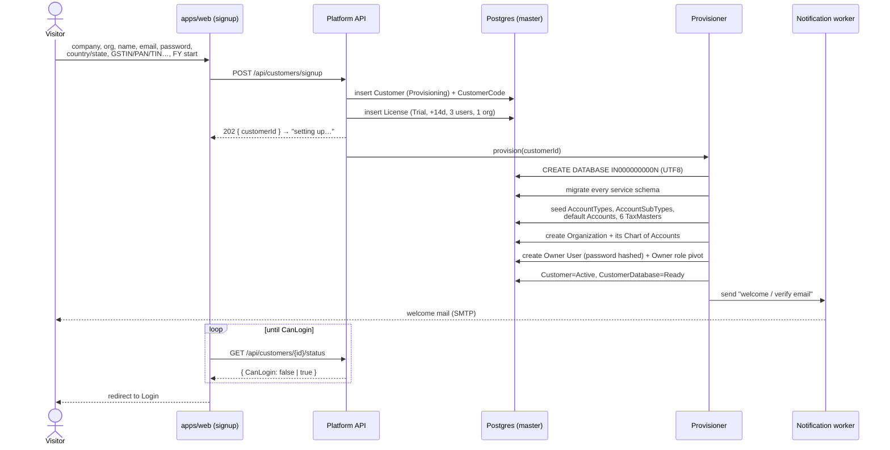
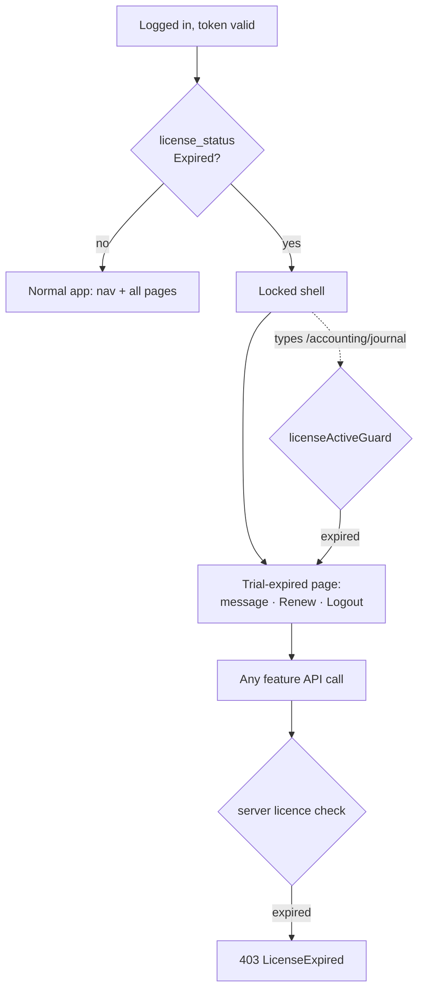

# SPEC.md — Tables & Pages

Build spec for **RetailErp**. Read `CLAUDE.md` first for conventions and hard rules; this file is the concrete what-to-build.

**Status key**: ✅ built · 🔨 designed, not built · 📋 scoped only, needs design

---

# PART 1 — TABLES

All columns below are in addition to the four inherited from `AuditableEntity`:
`CreatedBy` (Guid, required) · `CreatedAt` (DateTimeOffset, required) · `ModifiedBy` (Guid?) · `ModifiedAt` (DateTimeOffset?)

## System-master naming convention

Every seeded/system master row carries **two names**:

| Column | Editable | Purpose |
|---|---|---|
| `SystemName` | **No** — set at seed, immutable | The canonical identity. All code, reports, GSTR mapping and seed logic key on this (or the id), never on the display name |
| `DisplayName` | Yes | What the UI shows. The user may rename it |

The rule: **a user can rename a system master for display, but can never change what it *is*.** Renaming the "Cost of Goods Sold" subtype to "COGS / Direct Cost" changes the label on screen and on reports; it does not change that this row is the COGS control point the sale posting targets. `SystemName` is hidden on every screen.

Applies to the system masters the user asked to be renamable — **Chart of Accounts (`AccountTypes`, `AccountSubTypes`, system `Accounts`), Roles, Tax Master** — and to any future reference master with `IsSystem = true`. For a customer-created row (`IsSystem = false`) the two names are seeded equal and both stay editable.

Enforcement: on update of a row where `IsSystem = true`, reject any change to `SystemName` (or any column other than `DisplayName` and active flag) with `Forbid()`.

---

## MASTER DATABASE

### `mst.Countries` ✅
Seeded reference data. Referenced by `plt.Organizations` (real FK, same database) and by per-customer Contacts (unenforced id — cross-database FK impossible).

| Column | Type | Rules |
|---|---|---|
| CountryId | int | PK, **not** identity — explicit ids for seeding |
| CountryCode | string(2) | Required, unique. ISO 3166-1 alpha-2 |
| CountryName | string(100) | Required |
| CurrencyCode | string(3) | Required. ISO 4217 |
| PhoneCode | string(5)? | e.g. `+91`, `+1` |
| IsActive | bool | Default true |

Navigation: `ICollection<State> States`

**Seed**: IN/India/INR/+91, US/United States/USD/+1, GB/United Kingdom/GBP/+44, AE/United Arab Emirates/AED/+971, SG/Singapore/SGD/+65

### `mst.States` ✅
| Column | Type | Rules |
|---|---|---|
| StateId | int | PK, not identity |
| CountryId | int | Required, FK → Countries |
| StateCode | string(5) | Required. **For India this is the 2-digit GST state code** |
| StateName | string(100) | Required |
| IsActive | bool | Default true |

Unique index: (CountryId, StateCode)

**Seed** — all 37 Indian states/UTs by GST code: 01 Jammu and Kashmir, 02 Himachal Pradesh, 03 Punjab, 04 Chandigarh, 05 Uttarakhand, 06 Haryana, 07 Delhi, 08 Rajasthan, 09 Uttar Pradesh, 10 Bihar, 11 Sikkim, 12 Arunachal Pradesh, 13 Nagaland, 14 Manipur, 15 Mizoram, 16 Tripura, 17 Meghalaya, 18 Assam, 19 West Bengal, 20 Jharkhand, 21 Odisha, 22 Chhattisgarh, 23 Madhya Pradesh, 24 Gujarat, 26 Dadra and Nagar Haveli and Daman and Diu, 27 Maharashtra, 29 Karnataka, 30 Goa, 31 Lakshadweep, 32 Kerala, 33 Tamil Nadu, 34 Puducherry, 35 Andaman and Nicobar Islands, 36 Telangana, 37 Andhra Pradesh, 38 Ladakh, 97 Other Territory

### `mst.Currencies` ✅
Seeded reference data. The single source for currency code, symbol and display formatting — feeds `libs/shared/currency-format` on the frontend and base-currency conversion on the backend. Referenced by `mst.Countries.CurrencyCode` and `plt.Organizations.BaseCurrency` (real FKs, same DB) and by every per-customer transaction's `CurrencyCode` (unenforced string — cross-database).

| Column | Type | Rules |
|---|---|---|
| CurrencyId | int | PK, **not** identity — explicit ids for seeding |
| Code | string(3) | Required, unique. ISO 4217 |
| Name | string(60) | Required, e.g. `Indian Rupee` |
| Symbol | string(5) | Required, e.g. `₹` `$` `£`. UTF-8, may be multi-char (`CHF`, `kr`) |
| Format | string(30) | Required. Display mask, e.g. `###,###,##0.00` |
| DecimalPlaces | int | Required, default 2. **Drives money rounding, not just display** — JPY 0, KWD 3 |
| SymbolPosition | enum→string(6) | `Prefix` / `Suffix`, default Prefix |
| IsActive | bool | Default true |

**`Format` is the grouping mask, and India is the reason it's a column, not a constant.** Western grouping is threes — `###,###,##0.00` → `1,234,567.89`. Indian grouping is the lakh/crore pattern — `##,##,##0.00` → `12,34,567.89`. A single hard-coded format would render Indian amounts wrong, so each currency carries its own. `DecimalPlaces` is separate because rounding money must never be inferred from a display string.

**Seed** (matching the seeded countries, extend as needed):

| Id | Code | Name | Symbol | Format | Dp |
|---|---|---|---|---|---|
| 1 | INR | Indian Rupee | ₹ | `##,##,##0.00` | 2 |
| 2 | USD | US Dollar | $ | `###,###,##0.00` | 2 |
| 3 | GBP | Pound Sterling | £ | `###,###,##0.00` | 2 |
| 4 | AED | UAE Dirham | د.إ | `###,###,##0.00` | 2 |
| 5 | SGD | Singapore Dollar | S$ | `###,###,##0.00` | 2 |

> The user asked for "all currencies" — the five above match the seeded countries. The full ISO 4217 set (~180) is a larger seed to load at implementation from a data file, not to enumerate here. INR is the lone lakh/crore format; the rest use the threes mask, most at 2 dp (notable exceptions: JPY/KRW 0, KWD/BHD/OMR 3).

---

### `mst.TransactionTypes` 🔨
Every document type that can post to the ledger. **Three-letter code as the key.** Referenced from per-customer tables by unenforced code — cross-database FK is impossible, so validate in C#.

| Column | Type | Rules |
|---|---|---|
| Code | string(3) | PK. Exactly three letters, uppercase |
| Name | string(50) | Required, unique |

**Seed** — 16 types:

| Code | Name |
|---|---|
| QTE | Quote |
| BIL | Bill |
| POR | Purchase Order |
| GRN | Goods Receipt |
| SOR | Sales Order |
| INV | Invoice |
| CRN | Credit Note |
| DBN | Debit Note |
| JRN | Journal |
| SPM | Spend Money |
| RCM | Receive Money |
| TRM | Transfer Money |
| OPB | Opening Balance |
| DEP | Depreciation |
| STA | Stock Adjustment |
| POS | POS Sale |

The code is both the key and what appears on screen and in document numbers, so a ledger row reads without a join.

### `mst.LedgerTypes` 🔨
**Which leg** of a document a ledger row represents.

| Column | Type | Rules |
|---|---|---|
| LedgerTypeId | int | PK, not identity |
| Code | string(20) | Required, unique |
| Name | string(50) | Required |

**Seed**: 1 `ITEM` Line item · 2 `TAX` Tax · 3 `CONTROL` AP / AR / bank / cash control leg · 4 `COGS` Cost of goods sold · 5 `FX` Realized exchange gain or loss · 6 `ROUNDOFF` Rounding

### `mst.LedgerSources` 🔨
**What produced** the ledger row. Since a payment and a refund share the same transaction type — both are Spend Money or Receive Money — this is what tells them apart. Anything that needs to distinguish them (refunds report, GST return, bank reconciliation) filters on `LedgerSourceId`, not on `TransactionTypeCode`.

| Column | Type | Rules |
|---|---|---|
| LedgerSourceId | int | PK, not identity |
| Code | string(20) | Required, unique |
| Name | string(50) | Required |
| Direction | enum→string(10) | In / Out / Both. Sanity-check against the transaction type |

**Seed** — the `Typical type` column is guidance, not a constraint:

| Id | Code | Name | Typical type | Direction |
|---|---|---|---|---|
| 1 | TRANSACTION | Document posting | BIL, INV, CRN, DBN, POS, GRN | Both |
| 2 | BILLPAYMENT | Bill payment | SPM | Out |
| 3 | INVOICEPAYMENT | Invoice payment | RCM | In |
| 4 | BILLREFUND | Bill refund received | RCM | In |
| 5 | INVOICEREFUND | Invoice refund paid | SPM | Out |
| 6 | CREDITNOTEREFUND | Credit note refund paid | SPM | Out |
| 7 | DEBITNOTEREFUND | Debit note refund received | RCM | In |
| 8 | VENDORPREPAYMENT | Advance paid to vendor | SPM | Out |
| 9 | CUSTOMERPREPAYMENT | Advance received from customer | RCM | In |
| 10 | ALLOCATION | Credit note, debit note or prepayment allocation | CRN, DBN | Both |
| 11 | MONEYTRANSFER | Bank or cash transfer | TRM | Both |
| 12 | JOURNAL | Manual journal | JRN | Both |
| 13 | OPENINGBALANCE | Opening balance | OPB | Both |
| 14 | DEPRECIATION | Depreciation | DEP | Out |
| 15 | STOCKADJUSTMENT | Stock adjustment | STA | Both |

Payment and refund are deliberately **paired in opposite directions**: `BILLPAYMENT` pays a vendor and `BILLREFUND` receives money back from one, so the pair reconciles. Same for `INVOICEPAYMENT` / `INVOICEREFUND`.

`MONEYTRANSFER` is the one source with no contact — both legs are bank or cash accounts, so `ContactId` and `SubAccountId` are null and there is no AP/AR control leg.

---

### `plt.Customers` ✅
The account/billing entity. **One Customer = one physical database.**

| Column | Type | Rules |
|---|---|---|
| CustomerId | Guid | PK |
| CustomerCode | string(10) | Required, unique. 10-digit sequential, zero-padded (`D10`), generated in C# |
| CountryPrefix | string(2) | Required, default `IN` |
| Name | string(200) | Required |
| BillingEmail | string(200) | Required, email |
| Status | enum→string(20) | Provisioning / Active / Suspended / Trial / Expired |
| PlanTier | string(30) | Required, default `Standard` |

Navigation: `ICollection<Organization> Organizations`, `CustomerDatabase? CustomerDatabase`, `License License`

Database name = `CountryPrefix + CustomerCode` → `IN0000000001`

### `plt.Licenses` 🔨
One per Customer. A **Trial** licence is created automatically at signup — the customer never picks it.

| Column | Type | Rules |
|---|---|---|
| LicenseId | Guid | PK |
| CustomerId | Guid | Required, FK → Customers, unique (one-to-one) |
| LicenseType | enum→string(20) | Required, default `Trial`. Trial / Standard / Professional / Enterprise |
| StartDate | DateOnly | Required, default today |
| ExpiryDate | DateOnly | Required. Trial = StartDate + 14 days |
| MaxUsers | int | Trial default 3 |
| MaxOrganizations | int | Trial default 1 |
| IsActive | bool | Default true |
| GraceDays | int | Default 0. Read-only access window after expiry, if any |

A licence is **expired** when `today > ExpiryDate + GraceDays`. Expiry is evaluated at login and stamped onto `Customers.Status = Expired`; it does not need a nightly job, though one may flip status proactively for reporting. **Expiry blocks the app, never the login** — see the trial-expiry flow.

### `plt.Organizations` ✅
A set of books. Many per Customer, sharing that Customer's database, separated by `OrgId`.

| Column | Type | Rules |
|---|---|---|
| OrgId | Guid | PK |
| CustomerId | Guid | Required, FK → Customers |
| Name | string(200) | Required |
| BaseCurrency | string(3) | Required, default `INR` |
| FinancialYearStartMonth | int | Range 1–12, default 4 (April) |
| Gstin | string(15)? | |
| Pan | string(10)? | |
| Tan | string(10)? | |
| Tin | string(15)? | |
| Cin | string(21)? | |
| UdyamNumber | string(20)? | |
| LogoUrl | string(500)? | Blob storage path — never store the image itself |
| Status | enum→string(20) | Provisioning / Active / Suspended / Trial |
| AddressLine1 | string(200)? | |
| AddressLine2 | string(200)? | |
| City | string(100)? | |
| StateId | int? | FK → mst.States |
| PostalCode | string(10)? | |
| CountryId | int | Required, FK → mst.Countries |
| PhoneNumber | string(20)? | Regex `^\d{2,}[\s\-]?\d{3,}$` — STD code mandatory |
| MobileNumber | string(20)? | No regex — lengths vary by country |
| Email | string(200)? | Email |
| Website | string(200)? | Url |

Unique index: (CustomerId, Name)

**Validate `StateId`'s StateCode matches Gstin's first 2 digits** — a mismatch silently breaks CGST/SGST vs IGST.

### `plt.OrgCurrencies` 🔨
The currencies an organization actually transacts in — a per-org subset of `mst.Currencies`. Inherits `AuditableEntity` (who enabled a currency and when is worth an audit trail). Lives in `plt` so it can FK both `Organizations` and `mst.Currencies`; a per-customer-DB table could reference neither.

| Column | Type | Rules |
|---|---|---|
| OrgCurrencyId | Guid | PK |
| OrgId | Guid | Required, FK → Organizations |
| CurrencyId | int | Required, FK → mst.Currencies |
| IsBaseCurrency | bool | Default false. **Exactly one true per org** |
| IsActive | bool | Default true. Deactivate to retire a currency without losing history |
| *(+ AuditableEntity)* | | CreatedBy, CreatedAt, ModifiedBy, ModifiedAt |

Unique index: `(OrgId, CurrencyId)`, plus partial `UNIQUE (OrgId) WHERE IsBaseCurrency` so an org can have only one base.

- **Seeded at org creation** with one row: the org's `BaseCurrency`, `IsBaseCurrency = true`. `Organizations.BaseCurrency` stays the authority; this row must always match it, and the base row cannot be deactivated or deleted.
- This is what the **currency picker** on every transaction lists — an org sees only its active currencies, not all ~180.
- It also scopes **exchange-rate sync**: `rat.CurrencyRates` only needs rates for pairs an org has enabled here.

### `plt.CustomerDatabases` ✅
Tenant directory.

| Column | Type | Rules |
|---|---|---|
| CustomerId | Guid | PK **and** FK → Customers (one-to-one) |
| DatabaseName | string(63) | Required, unique. Postgres identifier limit |
| ConnectionSecretRef | string(200) | Required. **Key Vault reference — never the raw connection string** |
| Status | enum→string(20) | Provisioning / Ready / Failed |
| ProvisionedAt | DateTimeOffset? | |

### `plt.ApiClients` 📋
| Column | Type | Rules |
|---|---|---|
| ApiClientId | Guid | PK |
| OrgId | Guid | Required |
| ClientId | string(100) | Required, unique |
| ClientSecretHash | string(500) | Required. **Hashed; shown once at creation** |
| Name | string(200) | Required |
| Scopes | string(1000) | Comma-separated, e.g. `read:inventory,write:sales` |
| RateLimitTier | string(30) | |
| IsActive | bool | Default true |

### `plt.PlatformAdminUsers` 📋
Operator staff, separate from tenant users in `idn`.

### `plt.SmtpSettings` 🔨
The outbound mail account used to send invitations, OTPs and password-reset mail. One system default (`CustomerId = null`); a customer may override with its own mailbox.

| Column | Type | Rules |
|---|---|---|
| SmtpSettingsId | Guid | PK |
| CustomerId | Guid? | **Null = system default.** Set = this customer's own mailbox |
| Host | string(200) | Required, e.g. `smtp.gmail.com` |
| Port | int | Required, e.g. 587 |
| UseSsl | bool | Default true |
| FromEmail | string(200) | Required, email. The `From` address |
| FromName | string(200) | Required, e.g. `Bill-Book` |
| Username | string(200) | Required. SMTP auth user (often = FromEmail) |
| PasswordEncrypted | string(1000) | Required. **Reversibly encrypted (AES via a Key Vault data-protection key) — NOT hashed.** The worker must recover the plaintext to authenticate to the SMTP server |
| IsActive | bool | Default true |

Unique index: `(CustomerId)` — one row per customer, one system row where null.

> **Encrypted, not hashed — and this is the one place that is correct.** Everywhere else a secret is stored (`Users.PasswordHash`, `RefreshTokens.TokenHash`, OTP codes) it is **hashed**, one-way, because we only ever need to *verify* it. An SMTP password is different: the Notification worker has to present the actual password to the mail server, so it must be recoverable. Store it AES-encrypted with a key from Key Vault, never plaintext, never in a log. The encryption key lives in Key Vault, not in the database or config.

---

### `idn.Users` ✅
| Column | Type | Rules |
|---|---|---|
| UserId | Guid | PK |
| Email | string(200) | Required, unique, email |
| PasswordHash | string(500) | **Hashed with BCrypt work factor 12 — one-way, never encrypted, never reversible.** Null/empty for invited users until they set one |
| DisplayName | string(200) | Required |
| MobileNumber | string(20)? | Stored with leading `+` for foreign numbers. Needed for OTP-by-SMS |
| EmailConfirmed | bool | |
| MobileConfirmed | bool | |
| TwoFactorEnabled | bool | |
| IsActive | bool | Default true |
| ThemePreference | string(10) | Default `System`. Light / Dark / System |
| FailedLoginCount | int | Lockout at 5 |
| LockedOutUntil | DateTimeOffset? | 15-minute lockout |
| LastLoginAt | DateTimeOffset? | |

### `idn.Roles` ✅
| Column | Type | Rules |
|---|---|---|
| RoleId | int | PK, identity |
| CustomerId | Guid? | **Null = built-in system role**; set = customer-defined |
| SystemName | string(100) | Required. **Immutable, hidden** — the canonical role identity |
| DisplayName | string(100) | Required. User-editable label |
| Description | string(300)? | |
| IsSystemRole | bool | System roles: permissions are read-only, but `DisplayName` and `Description` may be edited |
| IsActive | bool | Default true |

Unique index: `(CustomerId, SystemName)`, plus partial `UNIQUE (SystemName) WHERE CustomerId IS NULL` so two system roles can't share a name (Postgres treats nulls as distinct)

**Seed** (`SystemName` = `DisplayName` at seed): 1 Owner, 2 Administrator, 3 Accountant, 4 Sales, 5 Viewer — all `IsSystemRole = true`, `CustomerId = null`

A system role's **permission set** is fixed, but the customer may rename it — calling "Accountant" → "Finance Lead" for display — without altering what it grants.

### `idn.Permissions` ✅
| Column | Type | Rules |
|---|---|---|
| PermissionId | int | PK, identity |
| Code | string(100) | Required, unique. Format `{module}.{action}` |
| Module | string(50) | Required |
| Description | string(200)? | |

**Seed**: 12 modules × 10 actions = 120 permissions.
Modules: dashboard, contacts, crm, inventory, sales, purchase, accounting, banking, reports, settings, support, platform
Actions: view, create, edit, approve, void, delete, print, export, import, AllUserData

Role grants: Owner + Administrator → everything except `platform.*` · Viewer → all `.view` · Accountant → accounting, banking, reports, purchase · Sales → sales, contacts, crm

> **⚠ open — the module-level grants above now hand out `approve`, `void` and `AllUserData` wholesale.** With four actions, "Accountant → accounting, banking, reports, purchase" was a reasonable shorthand. With ten it also grants self-approval, voiding of posted documents, and visibility of every user's data in those modules. These three need per-role decisions rather than a blanket module grant.

`AllUserData` is a **data-scope** permission, not an action: without it a user sees only records they created, with it they see the whole organization's. It rides the same `{module}.{action}` format for consistency, but the authorization check is a query filter, not a gate on an endpoint.

### `idn.RolePermissions` ✅
| Column | Type | Rules |
|---|---|---|
| RolePermissionId | long | PK, identity |
| RoleId | int | Required, FK |
| PermissionId | int | Required, FK |

Unique index: (RoleId, PermissionId)

### `idn.UserOrganizationRoles` ✅
**The pivot that makes multi-org access work.** One login, different roles per organization.

| Column | Type | Rules |
|---|---|---|
| UserOrganizationRoleId | long | PK, identity |
| UserId | Guid | Required, FK → Users |
| OrgId | Guid | Required (no FK — Organizations owned by Platform service) |
| RoleId | int | Required, FK → Roles |
| IsActive | bool | Default true. Revoke by setting false, don't delete |

Unique index: (UserId, OrgId, RoleId)

### `idn.RefreshTokens` ✅
| Column | Type | Rules |
|---|---|---|
| RefreshTokenId | long | PK, identity |
| UserId | Guid | Required, FK |
| TokenHash | string(500) | Required, indexed. **SHA-256 — never plaintext** |
| ExpiresAt | DateTimeOffset | Required. 7 days |
| RevokedAt | DateTimeOffset? | Set on rotation, logout, or password reset |
| IpAddress | string(45)? | |
| UserAgent | string(300)? | |

### `idn.LoginHistories` ✅
| Column | Type | Rules |
|---|---|---|
| LoginHistoryId | long | PK, identity |
| UserId | Guid | Required, FK |
| OrgId | Guid? | |
| LoginAt | DateTimeOffset | Required |
| IsSuccessful | bool | |
| FailureReason | string(200)? | |
| IpAddress | string(45)? | |
| UserAgent | string(300)? | |

### `idn.PasswordResetTokens` ✅
Also used for **user invitations** — same mechanism, longer expiry.

| Column | Type | Rules |
|---|---|---|
| PasswordResetTokenId | long | PK, identity |
| UserId | Guid | Required, FK |
| TokenHash | string(500) | Required, indexed |
| ExpiresAt | DateTimeOffset | Required. **Invitation only, 7 days.** A long random link token |
| UsedAt | DateTimeOffset? | Single-use |

Invitations stay **link-based** (a long token in a URL). Forgot-password is now **OTP-based** — see below.

### `idn.OtpVerifications` 🔨
A short numeric code sent to email or mobile. Used by forgot-password, and reusable for mobile/email confirmation.

| Column | Type | Rules |
|---|---|---|
| OtpVerificationId | long | PK, identity |
| UserId | Guid | Required, FK |
| Purpose | enum→string(20) | Required. PasswordReset / EmailConfirm / MobileConfirm |
| Channel | enum→string(10) | Required. Email / Sms |
| Destination | string(200) | Required. The email or masked mobile the code went to |
| CodeHash | string(500) | Required. **The 6-digit code, hashed (SHA-256) — never stored plaintext** |
| ExpiresAt | DateTimeOffset | Required. **10 minutes** |
| AttemptCount | int | Default 0. **Lock after 5 wrong tries** |
| ConsumedAt | DateTimeOffset? | Single-use |

Indexes: `(UserId, Purpose, ExpiresAt)`.

The code is 6 digits, generated with a cryptographic RNG, and only its hash is stored — same discipline as passwords. A new request invalidates any unconsumed code for the same `(UserId, Purpose)`. Mobile delivery needs an **SMS provider**, which is not yet in the stack — see the flow note.

### `rat.CurrencyRates` 📋 / `rat.MetalRates` 📋
Dated history, not just today's rate. Manual override always available.

---

## PER-CUSTOMER DATABASE

Every table below needs `OrgId` (Guid, required) + EF Core global query filter + Postgres RLS policy.

### `acc.AccountTypes` 🔨
Reference data, **no `OrgId`** — identical for every organization.

| Column | Type | Rules |
|---|---|---|
| AccountTypeId | int | PK, not identity |
| SystemName | string(20) | Required, unique. **Immutable, hidden** |
| DisplayName | string(20) | Required. User-editable label |
| NormalBalance | enum | Debit / Credit |
| ReportSection | enum | BalanceSheet / ProfitAndLoss |
| SortOrder | int | |

**Seed** (`SystemName` = `DisplayName` at seed): 1 Asset/Debit/BalanceSheet · 2 Liability/Credit/BalanceSheet · 3 Equity/Credit/BalanceSheet · 4 Income/Credit/ProfitAndLoss · 5 Expense/Debit/ProfitAndLoss

### `acc.AccountSubTypes` 🔨
Reference data, **no `OrgId`**.

| Column | Type | Rules |
|---|---|---|
| AccountSubTypeId | int | PK, not identity |
| AccountTypeId | int | Required, FK |
| SystemName | string(50) | Required. **Immutable, hidden** |
| DisplayName | string(50) | Required. User-editable label |
| IsContra | bool | Normal balance opposite its type — reports subtract |
| SortOrder | int | |

Unique index: (AccountTypeId, SystemName)

**Seed**:
- Asset: Cash, Bank, Accounts Receivable, Inventory, Prepaid Expense, Advance to Vendor, Other Current Asset, Fixed Asset, Accumulated Depreciation *(contra)*, Input GST
- Liability: Accounts Payable, Credit Card, Advance from Customer, Output GST, TDS Payable, Other Current Liability, Long-term Liability
- Equity: Capital, Drawings, Retained Earnings, Opening Balance Equity
- Income: Operating Revenue, Sales Returns *(contra)*, Discount Given *(contra)*, Other Income
- Expense: Cost of Goods Sold, Purchase Returns *(contra)*, Operating Expense, Payroll Expense, Rent, Depreciation, Other Expense

### `acc.Accounts` 🔨
The Chart of Accounts. Seeded **per organization** at org creation.

| Column | Type | Rules |
|---|---|---|
| AccountId | long | PK, identity |
| OrgId | Guid | Required |
| AccountTypeId | int | Required, FK. **Denormalized — always derive from subtype on write** |
| AccountSubTypeId | int | Required, FK |
| AccountCode | string(20) | Required |
| AccountSystemName | string(200)? | System accounts only: immutable canonical name. Null for user accounts |
| AccountName | string(200) | Required. Display name. **Editable even on system accounts** |
| ParentAccountId | long? | Self-FK |
| CurrencyCode | string(3)? | Null = org base currency |
| IsSystemDefault | bool | Seeded control accounts — cannot be deleted; **config-locked from creation** (see below) |
| IsActive | bool | Default true. Operational — changeable any time |
| IsUsed | bool | Default false. Set true — **and never back** — the first time this account is referenced by any posting or master row. Drives the config lock |
| IsJE | bool | Default false. May this account be picked on a **manual journal** line. **Backend/admin only — never a customer-facing toggle**, and settable only while the config is unlocked |
| IsLock | bool | Default false. Posting freeze — **no posting of any kind**, manual or system. Operational, changeable any time; orthogonal to the config lock |
| IsSales | bool | Default false. Selectable as an income/revenue account on a **sales** document |
| IsPurchase | bool | Default false. Selectable as an expense/asset account on a **purchase** document |
| IsPayment | bool | Default false. Selectable as the settlement account on a **payment / receipt** (Spend/Receive Money) |
| IsBank | bool | Default false. This account **is** a bank or cash account — appears in bank pickers, reconciliation and Transfer Money |

Unique index: (OrgId, AccountCode) · Filtered indexes: `(OrgId) WHERE IsBank`, `(OrgId) WHERE IsSales`, `(OrgId) WHERE IsPurchase`

#### Configuration lock — what can change, and when

Two independent locks, deliberately not the same column:

- **`IsLock`** freezes *posting*. A used account stays fully configurable-for-posting until an admin sets this; a locked account still exists and still shows balances, it just rejects new lines. Reversible.
- **Config lock** freezes *what the account is*. It is **not** a stored flag — it is the condition `IsUsed = true OR IsSystemDefault = true`. Once true it never clears (an account cannot be un-used).

When the config is locked, these become **immutable**: `AccountTypeId`, `AccountSubTypeId`, `AccountCode`, `AccountSystemName`, and all the usage flags `IsJE`, `IsSales`, `IsPurchase`, `IsPayment`, `IsBank`. Still editable: `AccountName` (display), `IsActive`, `IsLock`, `ParentAccountId`.

The rules that produce it:
1. **First use flips `IsUsed`.** Any reference — a `JournalDetail` or `JournalLedger` row, a `SubAccount` parented to it, a document line, an opening balance — sets `IsUsed = true` in the same transaction, atomically. From that instant the account's nature is frozen: you cannot re-point a used Expense account to become an Asset, because its existing postings would silently reclassify.
2. **`IsJE` is backend-only.** It is never rendered as an editable control on the customer Chart-of-Accounts page. An operator sets it from the backend (admin tool / seed), and only while `IsUsed = false` and `IsSystemDefault = false`. After first use it is fixed like the rest.
3. **System accounts are locked from creation.** `IsSystemDefault = true` config-locks the row at seed — before any use — so the ten control accounts can never have their type, code or usage flags changed. Their flag values are fixed by the seed table below.

Enforcement lives on write: reject a change to any immutable column when the config lock holds, with `Forbid()`. A missing check here lets someone reclassify an account that already holds a year of postings.

**Seed at org creation**: Accounts Receivable, Accounts Payable, Inventory, Input GST, Output GST, Sales Revenue, Cost of Goods Sold, Realized FX Gain/Loss, Unrealized FX Gain/Loss, Opening Balance Equity — all `IsSystemDefault = true`

Flag defaults on the seeded accounts — the system posts to these directly, so they are **off** the manual-journal and document pickers:

| Account | IsJE | IsSales | IsPurchase | IsPayment | IsBank |
|---|---|---|---|---|---|
| Accounts Receivable | ✗ | ✗ | ✗ | ✗ | ✗ |
| Accounts Payable | ✗ | ✗ | ✗ | ✗ | ✗ |
| Inventory | ✗ | ✗ | ✗ | ✗ | ✗ |
| Input GST / Output GST | ✗ | ✗ | ✗ | ✗ | ✗ |
| Sales Revenue | ✗ | ✓ | ✗ | ✗ | ✗ |
| Cost of Goods Sold | ✗ | ✗ | ✓ | ✗ | ✗ |
| Realized / Unrealized FX | ✓ | ✗ | ✗ | ✗ | ✗ |
| Opening Balance Equity | ✓ | ✗ | ✗ | ✗ | ✗ |

A cash/bank account created later (e.g. "HDFC Current A/c") is the one that carries `IsBank = ✓` and `IsPayment = ✓`. None of the ten seeded control accounts is a bank account.

### `acc.SubAccounts` 🔨
Per-contact and per-item detail under a parent control account. Keeps the CoA small.

| Column | Type | Rules |
|---|---|---|
| SubAccountId | long | PK, identity |
| OrgId | Guid | Required |
| AccountTypeId | int | Required, FK. **Denormalized from parent Account** |
| AccountSubTypeId | int | Required, FK. **Denormalized from parent Account** |
| AccountId | long | Required, FK → Accounts |
| ReferenceType | enum→string(20) | Contact / Item / **Tax** |
| ReferenceId | long | Polymorphic pointer, no FK. ContactId, ItemId or **TaxRateId** |
| TaxComponent | enum→string(10) | Default `None`. **Cgst / Sgst / Igst** for `Tax` subaccounts; `None` for Contact/Item |
| SubAccountName | string(200) | Required |
| IsActive | bool | Default true |

Unique index: **(AccountId, ReferenceType, ReferenceId, TaxComponent)** — the component completes the key so three rows can share a parent and rate

**Auto-created**, always as a side effect of the owning master, never by hand:
- each **Contact** → 2 (Accounts Receivable, Accounts Payable)
- each **Item** → 3 (Inventory, Cost of Goods Sold, Sales Revenue)
- each **Tax Master** → up to **6** GST subaccounts — CGST, SGST and IGST in each direction:
  - under the **Input GST** control account: Input CGST, Input SGST, Input IGST — created when the rate `IsPurchase`
  - under the **Output GST** control account: Output CGST, Output SGST, Output IGST — created when the rate `IsSales`

For a `Tax` subaccount, `ReferenceId` is the `TaxRateId`, the **parent account gives the direction** (Input GST = Asset, Output GST = Liability), and **`TaxComponent` gives the component** (CGST/SGST/IGST). Together — parent + rate + component — the six rows are distinct under the unique index. `SubAccountName` reads e.g. `Output CGST — GST 18%`. This is the finest GST granularity: every posting lands on the right rate **and** the right component, so GSTR-1/3B and ITC can be built straight from the subledger.

Which components a transaction hits is set by tax determination, not stored per subaccount: intra-state → CGST + SGST subaccounts; inter-state → the IGST subaccount. All six stand ready; each posting uses the two-or-one that apply.

### `acc.TaxMasters` 🔨
| Column | Type | Rules |
|---|---|---|
| TaxRateId | long | PK, identity |
| OrgId | Guid | Required |
| TaxSystemName | string(50)? | Seeded rows only: immutable canonical name (e.g. `GST18`). Null for user-created rows |
| TaxName | string(50) | Required. Display name — editable on seeded rows |
| TotalRate | decimal(5,2) | Required |
| CgstRate | decimal(5,2) | Required. Check: `CgstRate = SgstRate` |
| SgstRate | decimal(5,2) | Required. Check: `CgstRate + SgstRate = TotalRate` |
| IgstRate | decimal(5,2) | Required. Check: `IgstRate = TotalRate` |
| CessRate | decimal(5,2) | Default 0 |
| EffectiveFrom | DateOnly | Required |
| EffectiveTo | DateOnly? | Null = currently in effect |
| IsSales | bool | Default true. Selectable as an **output** tax on sales documents |
| IsPurchase | bool | Default true. Selectable as an **input** tax on purchase documents |
| IsActive | bool | Default true |

At least one of `IsSales` / `IsPurchase` must be true — a rate usable on neither document is dead data. Filtered indexes: `(OrgId) WHERE IsSales`, `(OrgId) WHERE IsPurchase`, for the tax pickers.

**Creating a rate auto-creates its GST subaccounts** (`acc.SubAccounts`, `ReferenceType = Tax`): CGST, SGST and IGST under Input GST when `IsPurchase`, and the same three under Output GST when `IsSales` — up to six per rate. Deactivating or expiring a rate deactivates its subaccounts. Same event-driven pattern as Contact and Item subaccounts.

**Seed at org creation** (all seeded rows `IsSales = true` and `IsPurchase = true`, so each seeds all **six** GST subaccounts): GST 0% · 5% (2.5+2.5) · 12% (6+6) · 18% (9+9) · 28% (14+14) · **3% Bullion (1.5+1.5)**

### `acc.Journals` 🔨
Manual journal header.

| Column | Type | Rules |
|---|---|---|
| JournalId | long | PK, identity |
| OrgId | Guid | Required |
| JournalNo | string(30) | Required |
| JournalDate | DateOnly | Required |
| CurrencyCode | string(3) | Required |
| ExchangeRate | decimal(18,8) | Default 1. **Snapshot at JournalDate — never live** |
| Reference | string(200)? | |
| Memo | string? | Unbounded text |
| TransactionTypeCode | string(3) | Required → `mst.TransactionTypes`, no FK. `JRN` when hand-written, else the source document's type |
| SourceId | long? | Source document header, polymorphic, no FK |
| Status | enum→string(10) | Draft / Posted / Reversed |
| PostedAt | DateTimeOffset? | |
| PostedBy | Guid? | |
| ReversesJournalId | long? | Self-FK. Set on the **reversing** journal |
| ReversedByJournalId | long? | Self-FK. Set on the **reversed** journal |

Unique index: (OrgId, JournalNo) · Indexes: (OrgId, JournalDate), (OrgId, TransactionTypeCode, SourceId)

### `acc.JournalDetails` 🔨
Journal lines. Debit and credit are mutually exclusive per line.

| Column | Type | Rules |
|---|---|---|
| JournalDetailId | long | PK, identity |
| JournalId | long | Required, FK, cascade delete |
| LineNumber | int | Required |
| AccountId | long | Required, FK → Accounts |
| SubAccountId | long? | FK → SubAccounts. AR/AP → contact, item legs → item, **GST legs → the rate + component (CGST/SGST/IGST) subaccount**. Null only for bank and equity lines |
| DebitAmount | decimal(18,2) | Default 0 |
| CreditAmount | decimal(18,2) | Default 0 |
| DebitAmountBase | decimal(18,2) | Default 0 |
| CreditAmountBase | decimal(18,2) | Default 0 |
| BranchId | long? | **Reporting dimension only** |
| LineMemo | string(300)? | |
| ReversesJournalDetailId | long? | Self-FK. The original line this row reverses |
| ReversedByJournalDetailId | long? | Self-FK. The line that reversed this row |

Unique index: (JournalId, LineNumber) · Indexes: (ReversesJournalDetailId)

**Check constraints**:
- `chk_debit_credit_exclusive`: `(DebitAmount > 0 AND CreditAmount = 0) OR (CreditAmount > 0 AND DebitAmount = 0)`
- `chk_amounts_non_negative`: all four amounts ≥ 0

**No `OrgId`** — scoped via parent Journal.

**Deferred constraint trigger** (raw SQL in migration, no LINQ equivalent): on insert/update/delete, if parent status is `Posted`, sum(DebitAmountBase) must equal sum(CreditAmountBase). `DEFERRABLE INITIALLY DEFERRED` so multi-line inserts don't trip on intermediate state.

**Reversal is line-paired, not just header-paired.** `Journals` links the two documents; `JournalDetails` links each individual line to the line it offsets. Without the detail-level pair, a partially reversed journal cannot be told apart from a fully reversed one, and a reversal that omits a line still balances — so nothing catches it.

### `acc.JournalLedger` 🔨
**The single posting target.** Every financial document in the system — invoice, bill, payment, refund, journal, opening balance, depreciation, stock adjustment — writes its double-entry legs here and nowhere else. This is what reports read.

| Column | Type | Rules |
|---|---|---|
| LedgerId | long | PK, identity |
| OrgId | Guid | Required |
| LedgerDate | DateOnly | Required. Posting date |
| AccountId | long | Required, FK → Accounts. The GL account being hit |
| SubAccountId | long? | FK → SubAccounts. Set for AP, AR, Inventory **and GST** legs; null for bank and equity |
| TransactionTypeCode | string(3) | Required → `mst.TransactionTypes`, no FK |
| TransactionId | long | Required. Source document header |
| TransactionDetailId | long | Required, default 0. Source document line; `0` when the leg is not line-level |
| DebitAmount | decimal(18,2) | Default 0. Transaction currency |
| CreditAmount | decimal(18,2) | Default 0. Transaction currency |
| DebitAmountBase | decimal(18,2) | Default 0. `ROUND(DebitAmount / ExchangeRate, 2)` |
| CreditAmountBase | decimal(18,2) | Default 0. `ROUND(CreditAmount / ExchangeRate, 2)` |
| CurrencyCode | string(3) | Required |
| ExchangeRate | decimal(18,8) | Default 1. **Snapshot at LedgerDate — never live** |
| TaxExchangeRate | decimal(18,8)? | Tax may settle at a different rate |
| ContactId | long? | Customer or vendor. No FK — owned by Contacts |
| LedgerTypeId | int | Required → `mst.LedgerTypes`. Which leg this is |
| LedgerSourceId | int | Required → `mst.LedgerSources`. What produced it |
| SourceDocumentId | long? | Provenance |
| TransactionDesc | string(500)? | Description shown in the ledger |
| MappingTransactionId | long? | **Links a payment back to its document** |
| MappingTransactionTypeCode | string(3)? | **Type of the mapped document** |
| BranchId | long? | **Reporting dimension only** |
| JournalId | long? | Set when `LedgerSourceId = 12` (Journal) |

Indexes: (OrgId, LedgerDate) · (OrgId, AccountId, LedgerDate) · (OrgId, TransactionTypeCode, TransactionId) · (OrgId, MappingTransactionTypeCode, MappingTransactionId) · (OrgId, ContactId) · (OrgId, SubAccountId)

**Check constraints**: same two as `JournalDetails` — debit/credit exclusive, all four amounts ≥ 0.

**Deferred constraint trigger**: sum(DebitAmountBase) = sum(CreditAmountBase) per (`OrgId`, `TransactionTypeCode`, `TransactionId`). `DEFERRABLE INITIALLY DEFERRED`.

#### Document posting

One row per leg, all under the document's own `TransactionTypeCode`:

| Leg | Account | LedgerTypeId |
|---|---|---|
| Line item | Item's GL account | 1 `ITEM` |
| Tax | Tax GL account | 2 `TAX` |
| AP / AR control | Accounts Payable or Accounts Receivable | 3 `CONTROL` |
| COGS + Inventory | COGS and Inventory accounts | 4 `COGS` |

Posted documents only — a draft or void document writes nothing.

#### Payment posting and the mapping pair

A payment posts under its **own** identity (`SPM` Spend Money for a bill payment, `RCM` Receive Money for an invoice receipt) and points back at the document it settles:

| | Debit row | Credit row |
|---|---|---|
| `AccountId` | Accounts Payable — clears the liability | Bank or cash account |
| `TransactionTypeCode` | `SPM` | `SPM` |
| `TransactionId` | the payment id | the payment id |
| `TransactionDetailId` | payment line if line-level, else `0` | `0` |
| `LedgerTypeId` | 3 `CONTROL` | 3 `CONTROL` |
| `LedgerSourceId` | 2 `BILLPAYMENT`, or 8 `VENDORPREPAYMENT` | same |
| **`MappingTransactionId`** | **the bill's `TransactionId`** | same |
| **`MappingTransactionTypeCode`** | **`BIL`** | same |

That pairing is the whole mechanism for tracing a payment to its bill or invoice. It is also why payments never appear in stock tables — they carry no item dimension.

**Foreign-currency settlement** posts an extra pair to the Realized FX Gain/Loss account with `LedgerTypeId = 5`, mapped in the opposite direction (`MappingTransactionId` = the gain/loss source). Compute the gain or loss from the difference between the document's `ExchangeRate` and the payment's — never from a live rate.

**Idempotency.** Service Bus is at-least-once, so a consumer must dedup before inserting or a redelivered event doubles the ledger. Dedup on the source event id, and treat a document's ledger rows as a single atomic set — delete and re-post rather than patch.

### `acc.TransactionRatio` 🔨
Allocation between documents — a credit note applied across invoices, or a prepayment drawn down. Written alongside the ledger rows, never instead of them.

| Column | Type | Rules |
|---|---|---|
| TransactionRatioId | long | PK, identity |
| OrgId | Guid | Required |
| TransactionTypeCode | string(3) | Required. The allocating document, e.g. `CRN` Credit Note |
| TransactionId | long | Required |
| TransactionDetailId | long | Default 0 |
| MappingTransactionTypeCode | string(3) | Required. The target document, e.g. `INV` Invoice |
| MappingTransactionId | long | Required |
| MappingTransactionDetailId | long | Default 0 |
| AllocatedAmount | decimal(18,2) | Required. Transaction currency |
| AllocatedAmountBase | decimal(18,2) | Required. Base currency |
| Ratio | decimal(9,6) | Proportion of the target line consumed |
| AllocationDate | DateOnly | Required |
| CurrencyCode | string(3) | Required |
| ExchangeRate | decimal(18,8) | Default 1 |

Indexes: (OrgId, TransactionTypeCode, TransactionId) · (OrgId, MappingTransactionTypeCode, MappingTransactionId)

Allocations must never exceed the target's outstanding balance. Enforce in C# — the sum spans rows, so no check constraint can express it.

### `acc.vw_LedgerDetail` — combined transaction view 🔨
One flattened read model over `JournalLedger`, joining the names that reports and the ledger screen need, so every transaction type is queried the same way regardless of which service wrote it.

Resolves: `mst.TransactionTypes` (code, name), `mst.LedgerTypes`, `mst.LedgerSources`, `acc.Accounts` (code, name, type, subtype), `acc.SubAccounts` (name), and the mapped document's transaction-type code. `ContactId` stays an id — Contacts is another service, so resolve names in C#, **batched**.

Adds `RunningBalanceBase`, computed as a window function over (`OrgId`, `AccountId`) ordered by `LedgerDate`, `LedgerId`.

Mapped as an EF Core **keyless entity**. Two things it must have:

- **`security_invoker = true`** on the view. Without it the view runs as its owner and **bypasses the RLS policies on `JournalLedger`**, which would leak the general ledger across organizations. This is not optional.
- The EF global query filter on `OrgId` applies to the keyless entity as well — belt and braces alongside RLS.

> **⚠ `CREATE VIEW` is not in `CLAUDE.md`'s raw-SQL exception list.** That list is `CREATE DATABASE`, RLS policies, triggers and `set_config`. A view needs raw SQL in a migration, so either the list grows to include views, or this becomes a LINQ projection in the Reporting service instead of a database object. Decide before implementing.

### Not yet designed 📋
`acc.FixedAssets`, `acc.FixedAssetCategories`, `acc.DepreciationSchedules` · `con.*` Contacts · `crm.*` · `inv.*` · `sal.*` · `pur.*` · `bnk.*` · `sup.*` · `rpt.*` · `ntf.*` · `aud.AuditLog`

---

# PART 2 — PAGES

## Shell (all apps) 🔨
`libs/app-shell`

- **Desktop (≥768px)**: left icon rail — all primary nav items + "More" overflow, org switcher and avatar in top bar
- **Mobile (<768px)**: bottom tab bar — top 4 items + "More" sheet
- Same nav model both ways; breakpoint = Angular CDK handset
- Theme toggle: Light / Dark / System, persisted to `idn.Users.ThemePreference`

**Every page must work at ~360px**: grids → card lists, multi-column forms → single column, modals → full-screen sheets.

### Trial-expiry gate
When the access token's `license_status = Expired`, the shell enters a **locked state**:

- The user **is** logged in — the token is valid and the session is real
- A single **route guard** (`licenseActiveGuard`) sits above every feature route. If the licence is expired it **cancels navigation and renders the empty "Trial expired" page** instead of the requested feature — so typing a URL like `/accounting/journal` directly lands on the empty page, not the journal
- The empty page shows only: the expiry message, a Renew/Upgrade action, and Logout. Nav rail and tab bar render disabled
- The **only** routes allowed while expired: the expiry page itself, billing/upgrade, and logout
- The server enforces the same rule — every feature API returns `403` with `reason: "LicenseExpired"` when the licence is expired, so a hand-crafted request can't reach data the UI is hiding. The guard is UX; the API check is the real boundary

---

## Auth pages (`apps/web`, `apps/portal`) 🔨

### Login
`POST /api/auth/login` → email + password. Verified against `PasswordHash` with BCrypt. On success shows the org list; if only one org, auto-selects it.
- Errors: invalid credentials (generic message — never say which field), account locked (show unlock time), no org access
- **Licence is checked at login, not before.** An expired customer still authenticates — the response carries `licenseStatus: "Expired"`, and the app gates on it (trial-expiry flow below). Login itself never fails for expiry.
- 5 failed attempts → 15-minute lockout (`FailedLoginCount`, `LockedOutUntil`); every attempt writes `idn.LoginHistories`
- Link to Forgot password

### Organization selector
`POST /api/auth/select-organization` with `X-PreAuth-Token` header → access + refresh token.
- Shows org name and the user's role in each
- Skipped when the user has exactly one org
- Access token carries `license_status` and `license_expiry` claims so the shell can gate without a second call

### Forgot password — OTP
Three steps, all on one route with a wizard:

1. **Request** — `POST /api/auth/forgot-password` with email (or mobile). **Always returns 200 with the same message** and always advances to step 2, even for an unknown account — never reveal whether it exists. If the account *does* exist, a 6-digit OTP (`idn.OtpVerifications`, 10-min expiry) is sent via the Notification worker to email, or SMS if the user chose mobile and has a confirmed number.
2. **Verify** — `POST /api/auth/verify-otp` with the code. Wrong code increments `AttemptCount`; **5 wrong tries locks the code** and forces a new request. Expired code → ask to resend.
3. **Reset** — `POST /api/auth/reset-password` with the verified OTP reference + new password (min 8 chars, confirm field). On success **all refresh tokens are revoked** — redirect to login.

> **SMS delivery is not yet wired.** The stack has the Notification worker and SMTP for email; there is no SMS provider. Mobile OTP is specced but, until a provider (e.g. an SMS gateway) is added, only the **email** channel actually delivers. The mobile option should be hidden until then.

### Accept invitation
Invitations are **link-based**, not OTP: the user opens the tokenised URL from the invite mail (`idn.PasswordResetTokens`, 7-day expiry) and sets a password. Invited users have a null/empty `PasswordHash` until this completes, and cannot log in before it.

---

## Trial signup (`apps/web`, public) 🔨
`POST /api/customers/signup` — one public form that provisions a whole tenant.

**Account** — DisplayName (the person), Email, Password, MobileNumber
**Company / first organization** — CompanyName, OrganizationName, financial-year start date (defaults to 1 April), BaseCurrency (defaults from country)
**Statutory (India, all optional at signup, editable later)** — GSTIN, PAN, TAN, TIN, CIN, Udyam
**Location** — CountryId (dropdown from `/api/master/countries`), StateId (dependent dropdown), City, PostalCode

Validate GSTIN's first two digits against the chosen state's `StateCode` when GSTIN is supplied.

**What the server does on submit** (see the signup flow for the full sequence):
1. Create `plt.Customers` (Status = Provisioning) + generate `CustomerCode`
2. Create a **Trial `plt.Licenses`** — 14 days, 3 users, 1 org — automatically
3. `CREATE DATABASE`, run every service's migrations, seed master data (AccountTypes, AccountSubTypes, default Accounts, the 6 TaxMasters), create the first Organization and its Chart of Accounts
4. Create the owner `idn.Users` with the Owner role, password already hashed
5. Flip Customer + CustomerDatabase to Active/Ready

**After submit**: shows a "setting up your account" state and polls `GET /api/customers/{id}/status` until `CanLogin = true`. Provisioning creates a physical database — this is eventually consistent and login must be blocked until ready.

---

## User management (`apps/web` → Settings) 🔨
- **List**: `GET /api/users` — scoped to current org. Columns: DisplayName, Email, Role, MobileNumber, LastLoginAt, status (Invited / Active / Locked / Inactive). Mobile → card list.
- **Add / invite**: `POST /api/users` — full form: Email, DisplayName, MobileNumber, RoleId (dropdown from Role master), optional per-org role rows if the customer has more than one org. On save:
  1. Creates `idn.Users` with an empty `PasswordHash` and `EmailConfirmed = false`
  2. Writes the `idn.UserOrganizationRoles` pivot for the selected org(s)
  3. Issues an invitation token (`idn.PasswordResetTokens`, 7-day) and **sends the invite mail via the Notification worker + SMTP** — never a temporary password
  4. Blocks against the licence `MaxUsers` — over the cap returns `409` with an upgrade prompt
- **Edit**: change DisplayName, MobileNumber, role assignment. Cannot change Email (it's the identity).
- **Resend invite** / **Reset password (send OTP)** actions per row.
- **Revoke**: `DELETE /api/users/{id}` — sets `IsActive = false` on the org assignment (soft, per the pivot). **Cannot revoke yourself**, and cannot revoke the last active Owner.

## Role master (`apps/web` → Settings) 🔨
- **List**: `GET /api/roles` — system roles + this customer's own. Show user count per role, and a "System" badge.
- **Create/Edit**: `POST` / `PUT /api/roles` — DisplayName, Description, permission checkbox matrix grouped by module (`GET /api/roles/permissions`). **120 checkboxes** (12 modules × 10 actions), so the matrix needs a module accordion and select-all per row; at 360px it collapses to one module per screen.
- **System roles**: `DisplayName` and `Description` are editable, but the **permission matrix is read-only** and `SystemName` is never shown. The user can rename "Accountant" → "Finance Lead" for display; they cannot change what it grants or delete it. (Per the system-master naming convention.)
- **Delete**: soft delete, customer-defined roles only. Blocked (409) if assigned to any active user.

## SMTP settings (`apps/admin`, and `apps/web` → Settings for per-customer override) 🔨
Backs the invite / OTP / reset mail.
- Fields: Host, Port, UseSsl, FromEmail, FromName, Username, Password.
- **The password field is write-only** — the API accepts a new value and stores it AES-encrypted (`plt.SmtpSettings.PasswordEncrypted`); it is never returned to the client, shown as `••••••` with a "change" affordance.
- **Send test email** button verifies the settings before save.
- Platform admin edits the system default (`CustomerId = null`); a customer may set its own row to send from its own mailbox.

## Organization settings (`apps/web` → Settings) 📋
Tabs: Profile (name, logo upload, address, contact) · Statutory (GSTIN, PAN, TAN, TIN, CIN, Udyam) · Financial (base currency, FY start month, AP/AR due days, discount type) · Preferences (theme).

Validate `StateId`'s code matches GSTIN's first two digits.

## Chart of accounts (`apps/web` → Accounting) 📋
- Tree view grouped by AccountType → AccountSubType, with a flat searchable list toggle
- Create/edit: AccountCode, AccountName, AccountSubTypeId (grouped dropdown), ParentAccountId, CurrencyCode
- **AccountTypeId is derived from the selected subtype — never a separate input**
- **Usage flags** (IsSales, IsPurchase, IsPayment, IsBank) as a checkbox group — they decide which account pickers this account appears in. **`IsJE` is not shown here** — it is backend-only. `IsLock` is a separate toggle that freezes the account against all posting
- **Once the account has been used** (`IsUsed`), type, subtype, code and all usage flags render **read-only** — only display name, active and lock stay editable. System accounts are read-only this way from creation
- `IsSystemDefault` accounts cannot be deleted; deactivate instead. Their code and `AccountSystemName` are locked, but **`AccountName` (display) can be renamed** — same for the seeded types and subtypes
- Mobile: accordion by type

## Tax master (`apps/web` → Settings) 📋
- List: TaxName, TotalRate, CGST/SGST split, IGST, Sales/Purchase applicability, EffectiveFrom/To, active
- Create/edit: enter TotalRate → **CGST and SGST auto-fill as half each, IGST as the full rate**. Sales / Purchase checkboxes (at least one required) decide which document pickers the rate appears in
- Seeded rates (the 6 GST rows) can be **renamed for display** (`TaxName`) but their `TaxSystemName` and split are locked
- Saving a new rate silently provisions its Input/Output GST subaccounts — no separate step
- Effective-dated: editing a rate creates a new row and expires the old one rather than overwriting

## Journal entry (`apps/web` → Accounting) 📋
- Header: JournalNo (auto), JournalDate, CurrencyCode, ExchangeRate (auto from rate table at JournalDate, overridable), Reference, Memo
- Line grid: Account, SubAccount (optional), Debit, Credit, Branch, Memo
- **Running debit/credit totals with a difference indicator — Post disabled until balanced**
- Debit and credit are mutually exclusive per line: entering one clears the other
- Posted entries are read-only, with a Reverse action
- Mobile: line-per-card, not a horizontal-scrolling grid

## Ledger (`apps/web` → Accounting) 📋
Reads `acc.vw_LedgerDetail`. One screen for every transaction type, because they all post to the same table.

- Filters: date range, account, sub-account, contact, transaction type, ledger source, branch
- Columns: LedgerDate, TransactionType code, document number, description, contact, debit, credit, running balance
- **Currency toggle**: transaction currency or base currency — the view carries both
- Drill-through: a row opens its source document, resolved from `TransactionTypeCode` + `TransactionId`
- **Payment rows show what they settle**, resolved through `MappingTransactionTypeCode` + `MappingTransactionId` — a Spend Money row links back to its bill
- Reversals show paired against the original, from the journal reversal mapping
- Mobile: card list with debit/credit and running balance; filters in a full-screen sheet

## Platform admin (`apps/admin`) 📋
Customer list with provisioning status · Organization list per customer · API client management (secret shown once at creation) · Provisioning progress and failure retry.

---

# PART 3 — BUILD ORDER

1. **Fix the blockers first** — `AuthController.ResolveCustomerIdAsync` returns null, so login cannot complete. Implement `ISecretStore`, `IEventPublisher`, `IEmailSender` (or register no-op stubs so DI resolves). Then get a first successful `dotnet build` — this code has never been compiled.
2. **Accounting service** — the four chart-of-accounts tables, TaxMasters, Journals + JournalDetails, then `JournalLedger` and the combined view, with seed data. The three `mst` master tables (TransactionTypes, LedgerTypes, LedgerSources) come first — everything downstream stores their codes and ids
3. **Contacts service** — needed before Sales/Purchase can reference anyone
4. **Inventory service** — UOM, warehouses, items, batch tracking, shared stock pool
5. **Sales / Purchase** — document chains, both publishing events that Accounting consumes
6. **Banking, CRM, Support, Reporting**
7. **Background workers** — Notification, CostingEngine, RateSync
8. **Gateway** (YARP), then the Angular workspace

Frontend can start in parallel once Identity's endpoints are working — the shell, auth pages, and signup only need Identity and Platform.

---

# PART 4 — AUTH & TENANT FLOWS

The end-to-end sequences for login, signup, forgot-password, invitation and trial-expiry. Tables referenced live in PART 1.

## Signup + tenant provisioning

Public, self-service. One form creates a Customer, its database, a Trial licence, the first Organization and the Owner user.



Key points: the **Trial licence is automatic** — never chosen. Login is **blocked until `CanLogin = true`** because the database is created asynchronously. The owner's password is hashed (BCrypt) before it ever hits a row.

## Login (two-step, licence-aware)

```mermaid
sequenceDiagram
    actor U as User
    participant W as apps/web
    participant A as Identity API
    participant DB as master DB

    U->>W: email + password
    W->>A: POST /api/auth/login
    A->>DB: find User by email
    alt locked (LockedOutUntil > now)
        A-->>W: 423 locked — show unlock time
    else bad password
        A->>DB: FailedLoginCount++ ; LoginHistory(fail)
        A-->>W: 401 generic "invalid credentials"
    else ok
        A->>DB: reset FailedLoginCount ; LoginHistory(ok)
        A->>DB: read accessible orgs + License
        A-->>W: 200 pre-auth token (5 min) + orgs + licenseStatus
    end
    W->>A: POST /api/auth/select-organization (X-PreAuth-Token)
    A->>DB: resolve role + permissions for that org
    A-->>W: access token (15 min, incl. license_status) + refresh token (7 d)
    alt license_status = Expired
        W-->>U: land on **Trial-expired** page (locked shell)
    else active
        W-->>U: dashboard
    end
```

Expiry does **not** stop authentication — the token issues normally and carries `license_status`. The gate is in the shell and re-checked by every feature API.

## Trial-expired access



The user **can log in** but reaches only the empty expiry page — manual URL navigation is caught by the route guard and redirected there, and the API returns `403 LicenseExpired` so nothing is reachable by crafting a request. Renew and Logout are the only live actions.

## Forgot password — OTP

```mermaid
sequenceDiagram
    actor U as User
    participant W as apps/web
    participant A as Identity API
    participant DB as master DB
    participant N as Notification worker

    U->>W: enter email (or mobile)
    W->>A: POST /api/auth/forgot-password
    A->>DB: find user
    alt user exists
        A->>DB: insert OtpVerification (6-digit hash, 10 min)
        A->>N: send OTP (email now; SMS when provider added)
        N-->>U: OTP code
    else unknown
        Note over A: do nothing
    end
    A-->>W: 200 "if the account exists, a code was sent"  (identical either way)
    W-->>U: OTP entry screen (always)
    U->>W: enter code
    W->>A: POST /api/auth/verify-otp
    alt wrong / expired
        A->>DB: AttemptCount++ (lock after 5)
        A-->>W: 400 — retry or resend
    else correct
        A-->>W: 200 verified reference
        U->>W: new password + confirm
        W->>A: POST /api/auth/reset-password
        A->>DB: update PasswordHash (BCrypt)
        A->>DB: revoke ALL refresh tokens
        A-->>W: 200 → redirect to Login
    end
```

The response and the next screen are **identical whether or not the account exists** — the CLAUDE.md "always 200" rule, preserved with OTP. The code is hashed, 10-minute-lived, single-use, and locks after 5 wrong tries. Resetting revokes every session.

## Invite a user (link-based, not OTP)

```mermaid
sequenceDiagram
    actor Admin
    participant W as apps/web (Users)
    participant A as Identity API
    participant DB as master DB
    participant N as Notification worker
    actor Invitee

    Admin->>W: email, name, role
    W->>A: POST /api/users
    A->>DB: check License.MaxUsers (409 if over)
    A->>DB: create User (empty PasswordHash) + UserOrganizationRoles
    A->>DB: PasswordResetToken (invitation, 7 d)
    A->>N: send invite mail via SMTP
    N-->>Invitee: "You've been invited" + link
    Invitee->>W: opens tokenised link
    W->>A: POST /api/auth/reset-password (invite token)
    A->>DB: set PasswordHash (BCrypt) ; EmailConfirmed = true
    A-->>W: 200 → Login
```

Invitees get a **link, never a temporary password**. Until they complete it, `PasswordHash` is empty and login is refused. The invite mail goes through the same SMTP account as OTP/reset.

## Secret handling — one table of truth

| Secret | Table.Column | Method | Why |
|---|---|---|---|
| User login password | `Users.PasswordHash` | **Hash** (BCrypt 12) | Only ever verified |
| Refresh token | `RefreshTokens.TokenHash` | **Hash** (SHA-256) | Only ever verified |
| OTP code | `OtpVerifications.CodeHash` | **Hash** (SHA-256) | Only ever verified |
| Invite / reset link | `PasswordResetTokens.TokenHash` | **Hash** | Only ever verified |
| SMTP password | `SmtpSettings.PasswordEncrypted` | **Encrypt** (AES, Key Vault key) | Must be recovered to log in to the mail server |
| DB connection string | `CustomerDatabases.ConnectionSecretRef` | **Key Vault reference** | Never in the database at all |

The single rule: **hash what you only verify; encrypt only what you must replay.** The SMTP password is the sole thing in the system that is encrypted rather than hashed, and that is deliberate.

## Build-order note for these flows

These slot into build step 1 (Identity/Platform) and step 7 (Notification worker):
- `plt.Licenses`, `plt.SmtpSettings`, `idn.OtpVerifications` migrations, and the `license_status` claim
- `IEmailSender` backed by real SMTP reading `plt.SmtpSettings` (decrypting the password)
- `licenseActiveGuard` (frontend) + the `403 LicenseExpired` middleware (every service)
- SMS delivery is **deferred** until an SMS provider is chosen — mobile OTP stays hidden until then
